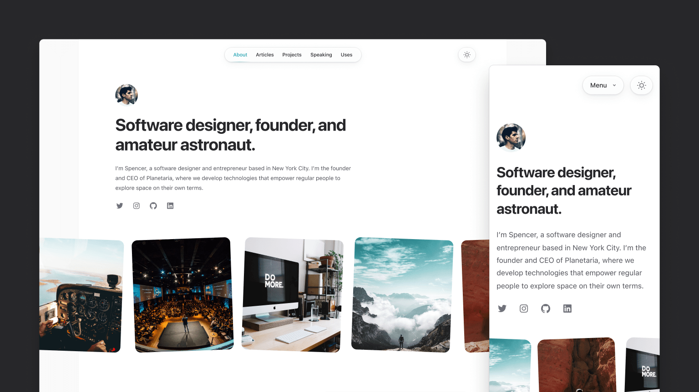
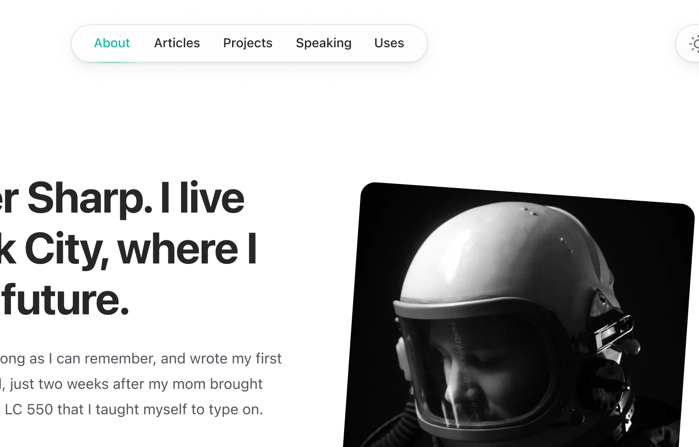

import { adamwathan } from '@/authors'
import card from './card.jpg'

export const meta = {
  title: 'We built you a new personal website + Heroicons v2.0, Headless UI v1.7, and more',
  description: `We just released a stunning new personal website template for Tailwind UI, redesigned Heroicons from scratch, tagged a new version of Headless UI with some exciting new features, and more.`,
  date: '2022-09-09T16:24:00.000Z',
  authors: [adamwathan],
  image: card,
}

{/*excerpt*/}

We just released a stunning new personal website template for Tailwind UI, redesigned Heroicons from scratch, tagged a new version of Headless UI with some exciting new features, and more.

{/*/excerpt*/}

It's been a busy week wrapping up a bunch of projects we've been working on, but everything is finally out the door so it feels like a good time for another update.

We triaged and resolved another [226 GitHub issues and pull requests](https://github.com/search?q=is%3Aclosed+org%3Atailwindlabs+archived%3Afalse+sort%3Acreated-desc+is%3Apublic+closed%3A%3E%3D2022-08-19+-author%3Aapp%2Fdependabot+-author%3Aapp%2Fgithub-actions+-author%3Aapp%2Fdepfu&type=Issues) since my last post, and we're finally at under 50 open issues/PRs across our entire organization for the first time ever. So please stop finding bugs I just want to design and build beautiful stuff with Tailwind CSS for a while.

Speaking of beautiful stuff, here's what shipped over the last couple of weeks!

---

## Spotlight: Your new personal website

A couple of days ago we released [Spotlight](https://tailwindui.com/templates/spotlight), a stunning new personal website template we designed for Tailwind UI.

[](https://tailwindui.com/templates/spotlight)

Like our other templates, it's built with [Next.js](https://nextjs.org/), and this time we're using [MDX](https://mdxjs.com/) to power all of the markdown-driven stuff like the blog section.

Designing this template was a pretty fun and interesting challenge — we wanted to come up with something that was really beautiful and inspiring, but that was also unopinionated enough to feel like a good fit for almost anyone. We landed on a pretty minimalist design that gets it's personality from little touches like rotated images, hints of color for links, and some subtle depth from shadows and layering in places like the top navigation.

[](https://spotlight.tailwindui.com)

As always, I recommend checking out [the live preview](https://spotlight.tailwindui.com/) for the full experience — especially pay attention to the way the avatar and navigation works on the home page as you scroll, it's very _\*chef's kiss\*_ when you're playing with the real site.

We tried to structure the site the way we'd structure our own personal sites, so it includes a dedicated blog, a page for you to list some of your favorite projects you've worked on, an area for you to link to things like conference talks you've given, and a ["uses" page](https://spotlight.tailwindui.com/uses) to list all of your favorite tools and gear.

If you've got a [Tailwind UI all-access](https://tailwindui.com/all-access) license then you've already got access to this template! And if you don't, consider it — it's the best way to support our work on open-source projects like Tailwind CSS, Headless UI, and Heroicons.

---

## Heroicons v2.0

Last year we released [Heroicons v1.0](/blog/heroicons-v1). Well last week we released [Heroicons v2.0](https://heroicons.com/), which is a brand new icon set, illustrated from scratch that Steve has been working on for about a year.

[](https://heroicons.com)

It includes 280 icons drawn in three distinct styles:

- **Outline** — line icons with a 1.5px stroke, drawn in a 24px view box.
- **Solid** — solid icons with filled shapes, drawn in a 24px view box.
- **Mini** — solid icons with filled shapes, drawn in a 20px view box.

The biggest differences from v1 are that the outline set uses a thinner stroke, which feels a bit more modern and fashionable these days, and visually the icons are a bit more playful in style.

Even though these have "v2" in the name, it's better to think of Heroicons v2 more like Terminator 2 than OpenSSL 2 — we feel like they represent our best work but it's a new icon set, not strictly an upgrade from the original icon set. Don't feel pressured to upgrade existing projects like you would with a real application dependency, but if you want to migrate, [check out the release notes](https://github.com/tailwindlabs/heroicons/releases/tag/v2.0.0) for everything you need to switch.

To explore all of the new icons, visit the totally [redesigned Heroicons website](https://heroicons.com/) we launched with the new set.

---

## Headless UI v1.7

Earlier this week we tagged a new release of [Headless UI](https://headlessui.com/), our React and Vue libraries of unstyled UI components.

[](https://headlessui.com)

Headless UI v1.7 includes the usual slew of bug fixes and improvements, but also some really useful new features!

### Added "by" prop for controlling object comparisons

We've added a new `by` prop to the `Listbox`, `Combobox`, and `RadioGroup` components that make it a lot less cumbersome to bind an object as the form value.

The `by` prop lets you specify which property of an object should be used for comparisons, so that the bound value and the corresponding value in the list of potential values no longer have to be the exact same object instance:

```jsx
import { Listbox } from '@headlessui/react'

const departments = [
  { id: 1, name: 'Marketing', contact: 'Durward Reynolds' },
  { id: 2, name: 'HR', contact: 'Kenton Towne' },
  { id: 3, name: 'Sales', contact: 'Therese Wunsch' },
  { id: 4, name: 'Finance', contact: 'Benedict Kessler' },
  { id: 5, name: 'Customer service', contact: 'Katelyn Rohan' },
]

function DepartmentPicker({ selectedDepartment, onChange }) {
  return (
    <Listbox value={selectedDepartment} by="id" onChange={onChange}>
      <Listbox.Button>{selectedDepartment.name}</Listbox.Button>
      <Listbox.Options>
        {departments.map((department) => (
          <Listbox.Option key={department.id} value={department}>
            {department.name}
          </Listbox.Option>
        ))}
      </Listbox.Options>
    </Listbox>
  )
}
```

This makes it a lot easier for the value to come from outside the component, and saves you having to just bind the `id` or similar and do a bunch of lookups yourself to find the full object when needed.

Check out the updated ["Binding objects as values" documentation](https://headlessui.com/react/listbox#binding-objects-as-values) for each component for some more detail.

### Use form controls as uncontrolled components

The `Listbox`, `Combobox`, and `RadioGroup` components now let you optionally pass a `defaultValue` instead of a `value`, allowing you to use them as an uncontrolled component.

```jsx
import { Listbox } from '@headlessui/react'

const people = [
  { id: 1, name: 'Durward Reynolds' },
  { id: 2, name: 'Kenton Towne' },
  { id: 3, name: 'Therese Wunsch' },
  { id: 4, name: 'Benedict Kessler' },
  { id: 5, name: 'Katelyn Rohan' },
]

function Example() {
  return (
    <form action="/projects/1/assignee" method="post">
      <Listbox name="assignee" defaultValue={people[0]}>
        <Listbox.Button>{({ value }) => value.name}</Listbox.Button>
        <Listbox.Options>
          {people.map((person) => (
            <Listbox.Option key={person.id} value={person}>
              {person.name}
            </Listbox.Option>
          ))}
        </Listbox.Options>
      </Listbox>
      <button>Submit</button>
    </form>
  )
}
```

This can simplify your code when using traditional HTML forms or form APIs that collect their state using `FormData` instead of tracking it using React state.

Check out the ["Using as an uncontrolled component" documentation](https://headlessui.com/react/listbox#using-as-an-uncontrolled-component) for each component to see some more examples.

### Data attributes for CSS-only state styling

Historically, you've always had to style the different states of a Headless UI component by inspecting arguments passed through a render prop and conditionally rendering whatever classes or content made sense. This could feel like a lot of boilerplate when just trying to tweak a background color or make some other CSS-only change.

In Headless UI v1.7, we've added a `data-headlessui-state` attribute to the rendered HTML that includes information about the current state so you can target it with just CSS.

We've also released a new [@headlessui/tailwindcss](https://github.com/tailwindlabs/headlessui/tree/main/packages/%40headlessui-tailwindcss) plugin that gives you variants for these states so they are super easy to style with just Tailwind CSS classes:

```jsx
<Listbox.Option
  key={person.id}
  value={person}
  className="ui-active:bg-blue-500 ui-active:text-white ui-not-active:bg-white ui-not-active:text-black"
>
  <CheckIcon className="hidden ui-selected:block" />
  {person.name}
</Listbox.Option>
```

Check out the new documentation on [styling using data attributes](https://headlessui.com/react/listbox#using-data-attributes) for some more details.

---

### Insiders support on Tailwind Play

Not everyone knows this but we ship an `insiders` build of Tailwind CSS to npm that is automatically built and deployed every single time a new commit lands in the repository. This makes it really easy to test out new features and fixes before they are actually tagged in a proper release.

Well now we include access to the insiders build in [Tailwind Play](https://play.tailwindcss.com/) as well, so you can play with bleeding edge stuff without even setting up a project:

[](https://play.tailwindcss.com)

We only keep the _latest_ insiders build on Play, so if you create a demo using an insiders build know that it might break if the next insiders build changes something in some unreleased feature you were using. You shouldn't be putting important things there anyways, come on be a professional.

---

### Tailwind CSS + Phoenix v1.7

A while ago we started talking with the [Phoenix](https://www.phoenixframework.org/) team because they wanted to ship Tailwind CSS by default in a future release. I thought this was super exciting, and wanted to work with them to make the out-of-the-box experience really beautiful.

We designed a new splash screen and all of the necessary scaffolding for their generator system, which will ship as part of Phoenix v1.7.


Chris McCord the creator of Phoenix gave [a great talk](https://www.youtube.com/watch?v=9-rqBLjr5Eo) last week that walks through all of the Tailwind CSS stuff they are shipping, worth a watch if you're curious to learn more.

---

So there you go, that's all of the coolest stuff we've been working on over the last few weeks!

Over the next month or so I'm excited to build a bunch of new Tailwind UI components we've been designing, explore some [new feature ideas](https://caniuse.com/?search=container%20queries) for Tailwind CSS, and start doing some R&D on what it would look like to create a sort of application starter kit template with Tailwind + Next.js — think it could be pretty cool if we can nail it.

Catch you in the next update!
