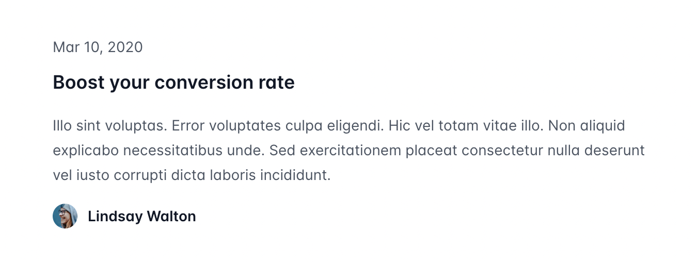

import { adamwathan } from '@/authors'
import exampleImage from './2023-03-22-16-29-14.png'
import { SnippetGroup } from '@/components/SnippetGroup'

export const meta = {
  title: 'Tailwind CSS v3.3: ESM support, logical properties, and one more color',
  description: `It's been months in the making but I'm excited to finally release our next website template — Protocol, a beautiful starter kit for building amazing API reference websites.`,
  date: '2023-03-27T15:00:00.000Z',
  authors: [adamwathan],
}

Here's an example of a new code block:

```js {{ filename: "tailwind.config.js", style: "framed" }}
module.exports = {
  theme: {
    fontFamily: {
      sans: [
        'Inter var, sans-serif',
        {
          fontFeatureSettings: '"cv11", "ss01"',
          fontVariationSettings: '"opsz" 32',
        },
      ],
    },
  },
}
```

```js tailwind.config.js
module.exports = {
  theme: {
    fontFamily: {
      sans: [
        'Inter var, sans-serif',
        {
          fontFeatureSettings: '"cv11", "ss01"',
          fontVariationSettings: '"opsz" 32',
        },
      ],
    },
  },
}
```

<SnippetGroup style="framed">

```css ./styles/admin.css
@config "./tailwind.admin.config.js";

@tailwind base;
@tailwind components;
@tailwind utilities;


```

```css ./styles/client.css
@config "./tailwind.client.config.js";
@tailwind base;
@tailwind components;
@tailwind utilities;
```

</SnippetGroup>


## Stylistic improvements

- Improve typography
- Fancy code block backgrounds


---

Something about Tailwind CSS v3.3 being released woohoo.

Probably an image here!

## Logical properties

- Demo of `ps-4` or something, showing the LTR and RTL design side by side
- Show `pl-4 rtl:pr-4` as the old solution?

## Extended color palette

- Screenshot (or real demo?) some examples of where this is actually useful, show before and after
  - Sexy dark UI
  - Colored background with colored headline

## ESM and TypeScript support

- Show an example config file, maybe tabbed example with all three formats?
- Talk about `init` improvements with `--esm` and `--ts` flag, and detecting project type?
- Talk about how it works? Frame it as "we've hesitated to implement because of this but you wanted it so here it is"

## Line-clamp by default

<!--  -->

- Demo with blog section thing on top, code below
- Mention removing it from your config obviously if you have it installed


## Line-height modifier

- Just a code demo, show the diff between the old way and new way
- While ago introduced color opacity modifier, got to thinking where else could we improve the authoring experience using modifiers?
- Explain found ourselves literally never changing the line-height without changing the font-size, so why not change them together and use a shorter syntax

## CSS variable shorthand

- Code demo showing the syntax

```html
<div class="bg-[${company.brandColor}]">

<div style="--brand-color: ${company.brandColor}; --brand-hover-color: ${company.brandHoverColor}" class="bg-[--brand-color] hover:bg-[--brand-hover-color]">
```

## Configure `font-variation-settings` for custom font families

- Example Inter Display
- Explain wtf `font-variation-settings` even is, give example of how Inter kinda ships multiple fonts in one file by taking advantage of this feature
- Now any time you use the `font-sans` utility, your font-variation-settings configuration will automatically be applied.

```
module.exports = {
  theme: {
    fontFamily: {
      sans: [
        'Inter var, sans-serif',
        {
          fontFeatureSettings: '"cv11", "ss01"',
          fontVariationSettings: '"opsz" 32',
        },
      ],
    },
  },
}
```

## More flexible variant stacking with `:is(...)`

- Explain issue, how couldn't put `dark` and `dir="rtl"` on same root element
- Explain how `:is()` works, show what we've changed
- Explain that as a bonus we've also applied the same improvements to the `important: "selector"` strategy

## New utilities

### Hyphens utilities

- Demo from docs

### Caption-side utilities

- Demo from docs

### List-style-image utilities

- Demo from docs (checkmark?)
