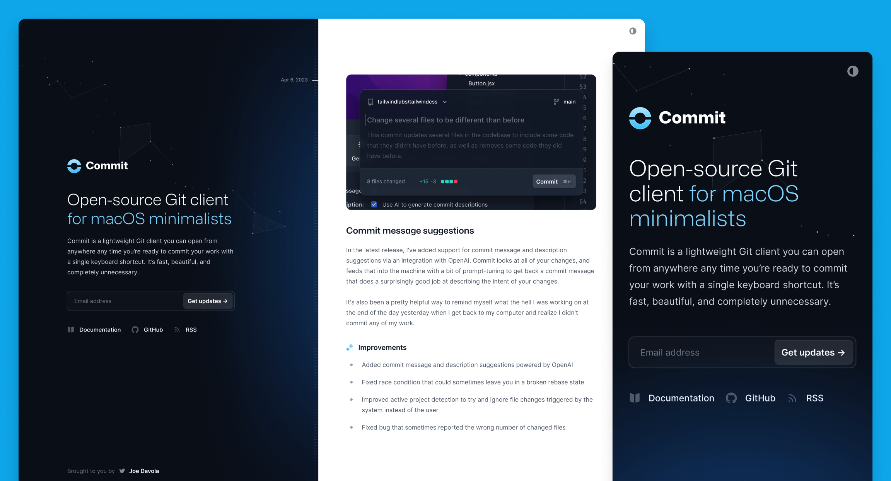
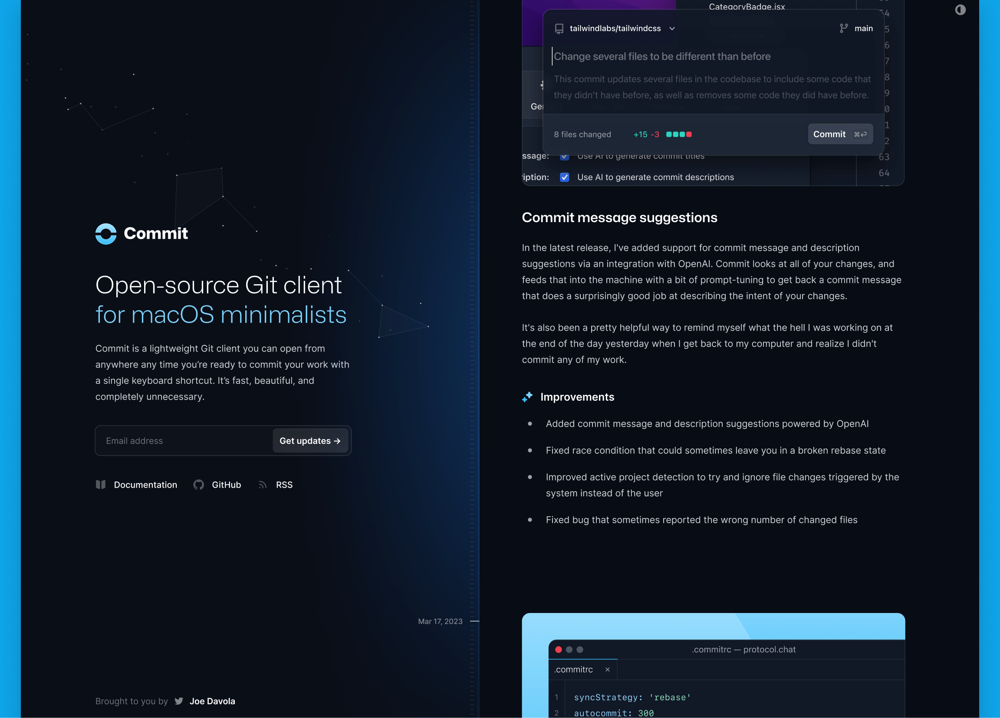
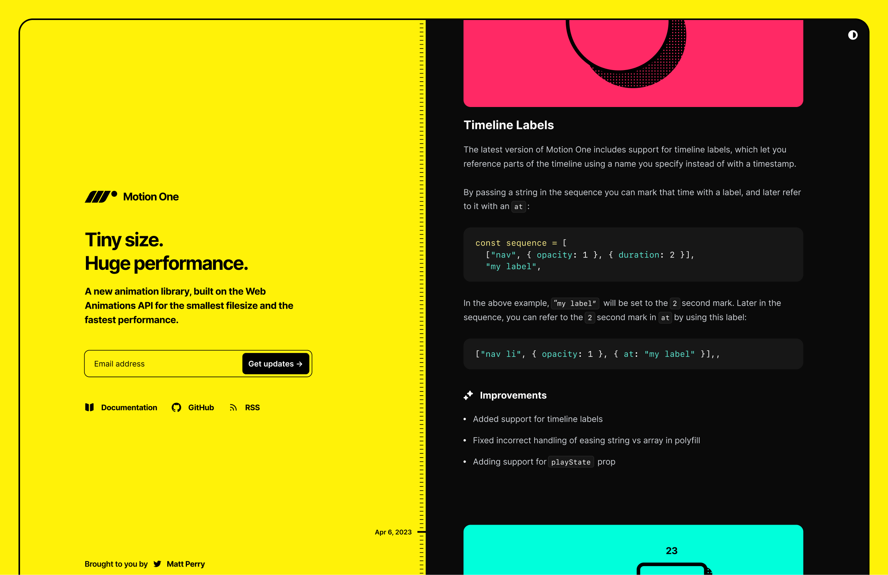
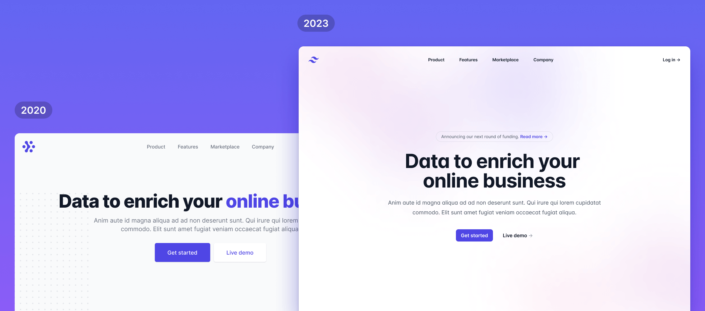
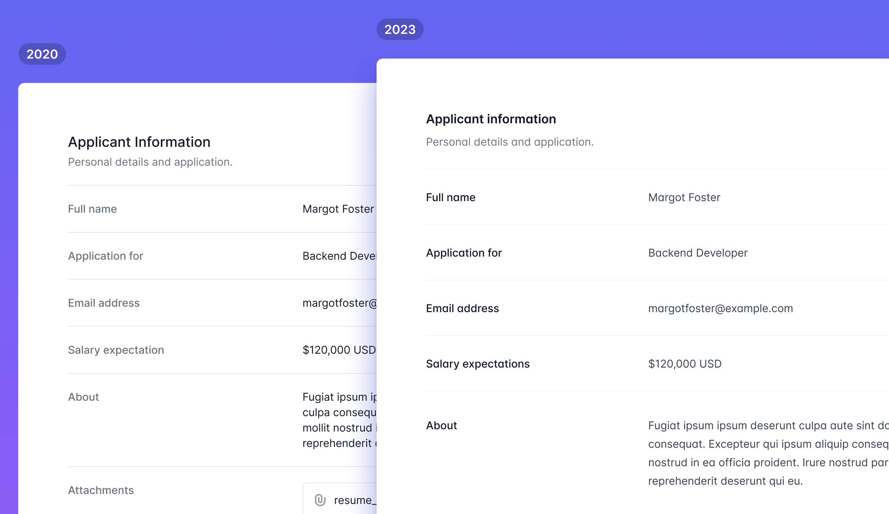
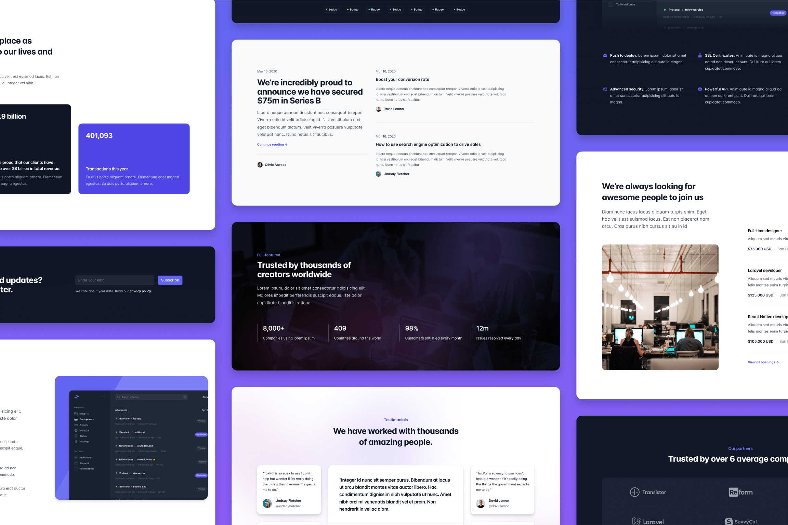
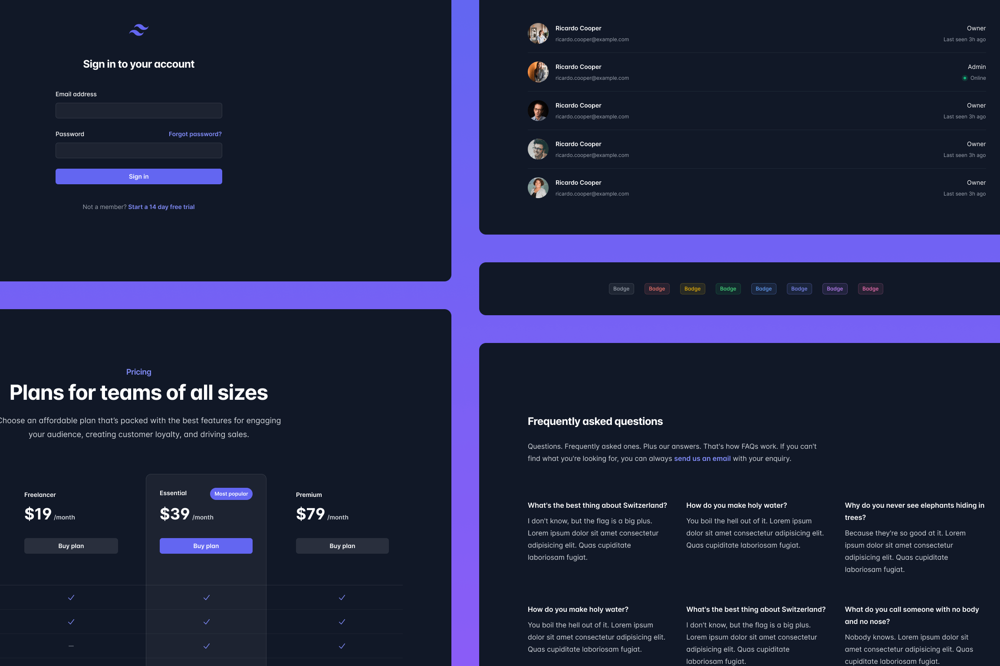
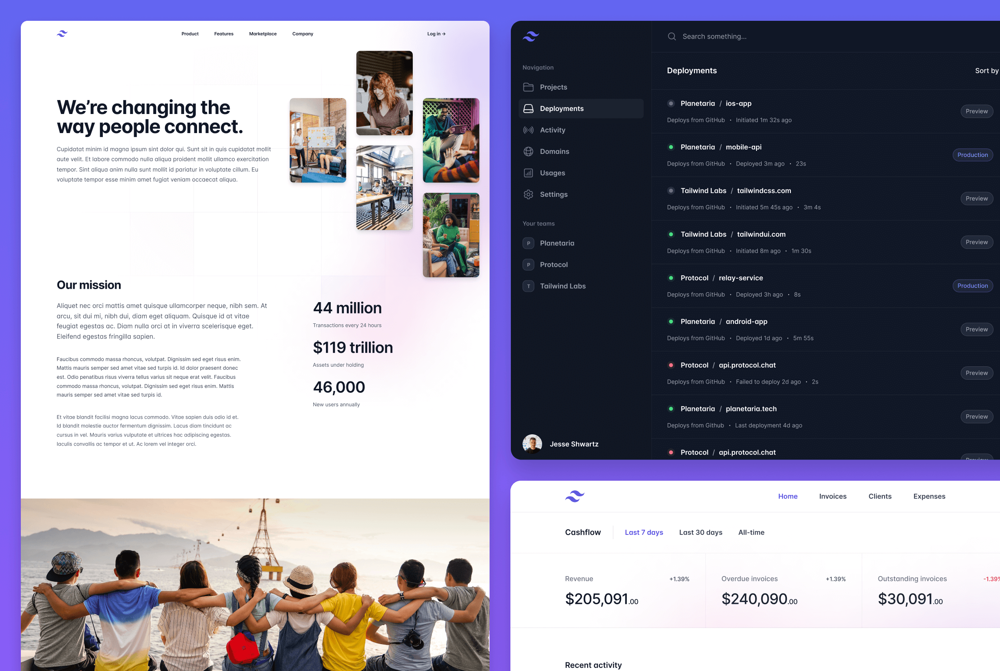

import { adamwathan } from '@/authors'
import twitterCard from './twitter-card.png'

export const meta = {
  title: 'New changelog template + the biggest Tailwind UI update ever',
  description: `Over the last four months we've probably done more work on Tailwind UI than we ever have, and having finally wrapped up what we set out to achieve I'm excited to lay it all out for you.`,
  date: '2023-04-24T14:00:00.000Z',
  authors: [adamwathan],
  image: twitterCard,
}

{/*excerpt*/}

Over the last four months we've probably done more work on Tailwind UI than we ever have, and having finally wrapped up what we set out to achieve I'm excited to lay it all out for you.

{/*/excerpt*/}

I haven't shared a Tailwind UI update since we released the [Protocol template](https://tailwindui.com/templates/protocol) in December, but that's not because we haven't been busy.

Over the last four months we've probably done more work on Tailwind UI than we ever have, and having finally wrapped up what we set out to achieve I'm excited to lay it all out for you!

---

## Commit: A beautiful changelog template for your next idea

Just a few days ago we released [Commit](https://tailwindui.com/templates/commit), a brand new changelog template we designed for Tailwind UI — built of course with Tailwind CSS and Next.js.

Public changelogs have become a really popular way to keep people in the loop about what you've been working on, and to stay accountable and build your shipping muscles. They aren't a new concept by any means of course, but I don't think it was until [Linear](https://linear.app/changelog) started publishing to their changelog site that others got excited about using them almost as an alternative to a company blog.

**Commit is our take on the modern product changelog**, designed as a single page website that can act as both your project homepage and a feed of everything you've been working on.

Like all of our templates, it's loaded with features and details that make it a delight to experience and a pleasure to work on:

- **Light and dark mode support**, because you can't make anything a developer might read without optimizing it for reading at 2am with the lights off.
- **Hand-crafted typography styles**, meticulously chosen font sizes, spacing, list styles, and more, designed specifically for this template.
- **Built-in syntax highlighting**, powered by [Shiki](https://github.com/shikijs/shiki), and easy to customize with a few CSS variables.
- **Single-file editing experience**, every entry lives in a single MDX file, so updating your changelog feels as lightweight as updating a `CHANGELOG.md` file in an open-source project.
- **Beautiful animations and effects**, this time powered by [Motion One](https://motion.dev/), making it a great resource for studying how to pull off these sorts of tricks with a cutting-edge new library.

As always it's easy to jump into the code and make it your own — here we've just tweaked a handful of colors and it feels like a totally different website:

Check out the [live demo](https://commit.tailwindui.com) for the full experience, and if you're already the proud owner of a [Tailwind UI all-access](https://tailwindui.com/all-access) license, download a copy of the template to use it in your next project or just to study the source code to learn a new trick or two.

---

## Redesigning hundreds of components for Tailwind UI

Design moves fast and with it being over three years since we first released Tailwind UI, we felt like it deserved to be put under the microscope and make sure it still felt like our best work.

We were pleasantly surprised to discover that yes, we have actually gotten better at design over the past three years, so we spent four months heads down making every component and category as pixel-perfect as we possibly could with our newfound powers.

Once we came out of our cave to see the sunlight again we had hundreds of redesigned components, dozens of totally new ideas put together, and a fresh batch of page examples to show them all off.

Here's a run down of some of the types of improvements we made.

### Redesigning existing patterns that felt dated

A lot of the component patterns in Tailwind UI are really timeless ideas, but as design trends change and we become better designers, the specific implementations of those patterns can start to feel like it's from another era.

We went through all of the components one-by-one and found lots of patterns we wanted to take another stab at and did our best to bring them into 2023.

Take a look at the [Hero Sections](https://tailwindui.com/components/marketing/sections/heroes) category for some great examples of what these refreshed patterns look like.

### Fine-tuning subtle details across the board

A lot of components didn't really need a full on redesign as much as they needed just a little bit of extra polishing.

We went through tons of components making subtle improvements to the spacing, typography, and contrast, and the results just feel so much sharper and cleaner.

The example above is from the [Description Lists](https://tailwindui.com/components/application-ui/data-display/description-lists) category — check it out there if you want to see it in its full browser-rendered glory.

### Designing a ton of brand new examples

As we were going through all of the existing components, we kept coming up with new ideas that felt like they were missing from the original set of patterns.

So we designed tons of brand new components, trying to fill as many holes that stood out to us as we could.

Lots of categories more than doubled in size, like the [Feature Sections](https://tailwindui.com/components/marketing/sections/feature-sections) category which is loaded with really killer new ideas.

### Adding more dark variations

It feels like almost every new website I see these days is dark by default, so it felt like we had a moral obligation to give you some more examples optimized for dark backgrounds.

One of examples I really like are these new [dark badges](https://tailwindui.com/components/application-ui/elements/badges#component-1a0b76697fe2397f5a2be799049ccd02) — there's not much to them really but that little bit of opacity on the background color is such a nice effect for dark designs.

### All-new page examples

Finally we took all of this new stuff and put together a bunch of brand new page examples to show them off, including the application UI example everyone has been bugging us for from the screenshots in some of our marketing components.

Check out the updated [Home Screens](https://tailwindui.com/components/application-ui/page-examples/home-screens) category for example to see some of these new designs.

---

So there you go, without a doubt our biggest Tailwind UI update of all time. We've been dripping out these improvements slowly since January and it's all captured in the [Tailwind UI changelog](https://tailwindui.com/changelog) so check that out if you want to dig in to what's changed in more detail.

Next up for us — digging in to a ton of ideas we have for Tailwind CSS v4.0, and exploring our first Next.js application starter kit. Excited to share more in the coming weeks!
