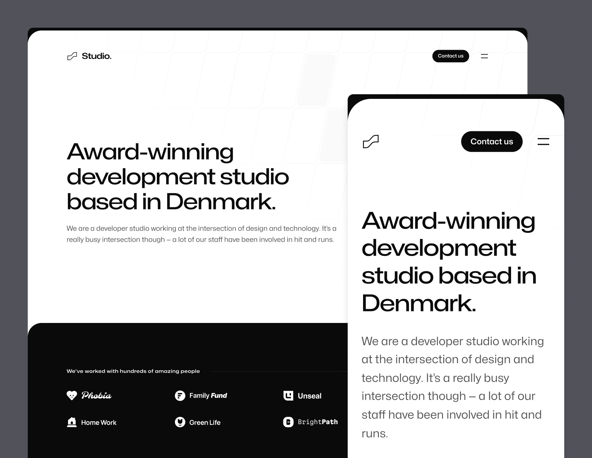

import { adamwathan } from '@/authors'
import twitterCard from './twitter-card.png'

export const meta = {
  title: 'Meet Studio: Our beautiful new agency site template',
  description: `We just released Studio — a beautiful new agency website template we've been working on for the last couple of months for Tailwind UI.`,
  date: '2023-08-07T10:30:00.000Z',
  authors: [adamwathan],
  image: twitterCard,
}

{/*excerpt*/}

We just released [Studio](https://tailwindui.com/templates/studio) — a beautiful new agency website template we've been working on for the last couple of months for Tailwind UI.

{/*/excerpt*/}


We just released [Studio](https://tailwindui.com/templates/studio) — a beautiful new agency website template we've been working on for the last couple of months for Tailwind UI.

[](https://tailwindui.com/templates/studio)

We built it with Next.js, MDX, and of course Tailwind CSS, and it's the first template we've published using the new Next.js [App Router](https://nextjs.org/docs/app).

Designing an agency template is an interesting project, because creative agencies commonly use their own website to show off some really flashy, bespoke ideas, and using a template just kind of feels strange when the goal is to show what your own company is capable of.

So we tried to approach this one with two goals in mind to actually make it useful to people:

1. **Teach people how to do some of the cool stuff you see on flash agency sites** — I've always believed our templates are just as (if not more) valuable as an educational resource than as simply templates, so we wanted to use this template as an opportunity to show off how we'd build a lot of the cool interactive and animated details you see on these sorts of sites.
2. **Design it for agencies that don't sell design** — there are a lot of agencies out there who just focus on engineering work, and a lot of the time those companies struggle to stand out design-wise. We tried to design this template in a way that it didn't depend on tons of screenshots of design work and stuff to look good, so that an agency that focuses on code could use it as a starting point for their own site.


I think what we came up with nailed these two goals and I'm really proud of how it all turned out.

Check out the [live preview](https://studio.tailwindui.com/) as always for the full experience — there are tons of cool details in this one that you have to see in the browser to really appreciate.

---

## Delightfully animated

One of the unspoken rules of agency websites is that they've gotta be flashy. We didn't go full replace-the-mouse-cursor or render-the-entire-site-with-WebGL but we did look for opportunities to tastefully introduce animations and interactivity wherever we could.

For instance, we built a light declarative component-based API around some features of [Framer Motion](https://www.framer.com/motion/) to make it easy to do scroll-triggered entrance animations:

<div className="relative rounded-2xl overflow-hidden">
  <div className="absolute inset-0 rounded-2xl ring-1 ring-inset ring-slate-900/10 pointer-events-none"></div>
  <video src="https://assets.tailwindcss.com/blog/2023-08-07-meet-studio-our-new-agency-template/scroll-entrance-animations.mp4" autoPlay playsInline loop muted className="block m-0" />
</div>

The authoring experience for these types of animations turned out really nice — just wrap the stuff you want to fade in with a `FadeIn` or `FadeInStagger` component and you're in business:

```jsx
function Clients() {
  return (
    <div className="mt-24 rounded-4xl bg-neutral-950 py-20 sm:mt-32 sm:py-32 lg:mt-56">
      <Container>
        <FadeIn className="flex items-center gap-x-8">
          <h2 className="text-center font-display text-sm font-semibold tracking-wider text-white sm:text-left">
            We’ve worked with hundreds of amazing people
          </h2>
          <div className="h-px flex-auto bg-neutral-800" />
        </FadeIn>
        <FadeInStagger faster>
          <ul
            role="list"
            className="mt-10 grid grid-cols-2 gap-x-8 gap-y-10 lg:grid-cols-4"
          >
            {clients.map(([client, logo]) => (
              <li key={client}>
                <FadeIn>
                  <Image src={logo} alt={client} unoptimized />
                </FadeIn>
              </li>
            ))}
          </ul>
        </FadeInStagger>
      </Container>
    </div>
  )
}
```

We also added this nice little animation to the logo where the mark is filled with a solid color on hover:

<div className="relative rounded-2xl overflow-hidden">
  <div className="absolute inset-0 rounded-2xl ring-1 ring-inset ring-slate-900/10 pointer-events-none"></div>
  <video src="https://assets.tailwindcss.com/blog/2023-08-07-meet-studio-our-new-agency-template/logo-hover-animation.mp4" autoPlay playsInline loop muted className="block m-0" />
</div>

This little detail looks small but interestingly you can't really do it without client-side navigation, because the animation would re-run when clicking the logo to go back to the homepage. Using a framework like Next.js, we're able to keep the logo filled in while hovering, even across URL changes, which feels a lot nicer.

The menu drawer animation turned out really nice as well, pushing the whole page down when it opens:

<div className="relative rounded-2xl overflow-hidden">
  <div className="absolute inset-0 rounded-2xl ring-1 ring-inset ring-slate-900/10 pointer-events-none"></div>
  <video src="https://assets.tailwindcss.com/blog/2023-08-07-meet-studio-our-new-agency-template/menu-slide-animation.mp4" autoPlay playsInline loop muted className="block m-0" />
</div>

If you look closely, the logo and button don't just naively change color either — it's actually driven precisely by the position of the sheet that's sliding down, and the logo is actually partially white and partially black at the same time when the edge of the sheet is intersecting with it.

Another detail I really love is this interaction we came up with for the images on the case study pages:

<div className="relative rounded-2xl overflow-hidden">
  <div className="absolute inset-0 rounded-2xl ring-1 ring-inset ring-slate-900/10 pointer-events-none"></div>
  <video src="https://assets.tailwindcss.com/blog/2023-08-07-meet-studio-our-new-agency-template/scroll-saturation-animation.mp4" autoPlay playsInline loop muted className="block m-0" />
</div>

We wanted the whole site to feel black and white, but showing black and white images all of the time didn't feel right. So we came up with this treatment where the image starts off black and white, and the saturation animates back in as the image gets close to the center of the screen when scrolling. We also show the full color image on hover.

We were also careful to try and implement all of these animations in a way that's mindful of people with vestibular motion disorders and are sensitive to these types of big animations. Using Framer Motion's `useReducedMotion` hook and the `motion-safe` variant in Tailwind, we do things like conditionally disable the navigation menu animation, and limit the scroll-driven entrance animations to opacity only so things aren't moving on the screen.

---

## Developer-centric case study and blog workflow

Studio includes support for both [case studies](https://studio.tailwindui.com/work/family-fund) and [blog posts](https://studio.tailwindui.com/blog/future-of-web-development), and as you might have guessed if you've played with any of our other templates, we used this an excuse to integrate [MDX](https://mdxjs.com/) into the project.

Here's an example of what a basic case study looks like — authored mostly in markdown with some common metadata and support for custom components mixed in to the content:

```jsx
import logo from '@/images/clients/phobia/logomark-dark.svg'
import imageHero from './hero.jpg'
import imageJennyWilson from './jenny-wilson.jpeg'

export const caseStudy = {
  client: 'Phobia',
  title: 'Overcome your fears, find your match',
  description:
    'Find love in the face of fear — Phobia is a dating app that matches users based on their mutual phobias so they can be scared together.',
  summary: [
    'Find love in the face of fear — Phobia is a dating app that matches users based on their mutual phobias so they can be scared together.',
    'We worked with Phobia to develop a new onboarding flow. A user is shown pictures of common phobias and we use the microphone to detect which ones make them scream, feeding the results into the matching algorithm.',
  ],
  logo,
  image: { src: imageHero },
  date: '2022-06',
  service: 'App development',
  testimonial: {
    author: { name: 'Jenny Wilson', role: 'CPO of Phobia' },
    content:
      'The team at Studio went above and beyond with our onboarding, even finding a way to access the user’s microphone without triggering one of those annoying permission dialogs.',
  },
}

export const metadata = {
  title: `${caseStudy.client} Case Study`,
  description: caseStudy.description,
}

## Overview

Noticing incredibly high churn, the team at Phobia came to the conclusion that, instead of having a
fundamentally flawed business idea, they needed to improve their onboarding process.

Previously users selected their phobias manually but this led to some users selecting things they
weren’t actually afraid of to increase their matches.

To combat this, we developed a system that displays a slideshow of common phobias during
onboarding. We then use malware to surreptitiously access their microphone and detect when they
have audible reactions. We measure the pitch, volume and duration of their screams and feed that
information to the matching algorithm.

The next phase is a VR version of the onboarding flow where users are subjected to a series of
scenarios that will determine their fears. We are currently developing the first scenario, working
title: “Jumping out of a plane full of spiders”.

## What we did

<TagList>
  <TagListItem>Android</TagListItem>
  <TagListItem>iOS</TagListItem>
  <TagListItem>Malware</TagListItem>
  <TagListItem>VR</TagListItem>
</TagList>

<Blockquote
  author={{ name: 'Jenny Wilson', role: 'CPO of Phobia' }}
  image={{ src: imageJennyWilson }}
>
  The team at Studio went above and beyond with our onboarding, even finding a
  way to access the user’s microphone without triggering one of those annoying
  permission dialogs.
</Blockquote>

<StatList>
  <StatListItem value="20%" label="Churn rate" />
  <StatListItem value="5x" label="Uninstalls" />
  <StatListItem value="2.3" label="App store rating" />
  <StatListItem value="8" label="Pending lawsuits" />
</StatList>
```

All of the typography styles for this template are totally custom and we took a bit of a different approach this time than we have in the past — instead of writing a bunch of complex CSS to avoid our typography styles clashing with any custom components in the MDX, we created a little remark plugin called [`remark-rehype-wrap`](https://github.com/bradlc/remark-rehype-wrap) that makes it possible to wrap chunks of Markdown content with a wrapper element.

This way, we could wrap anything that was vanilla Markdown content with a `typography` class, but make sure any custom components in the document were simply _not_ wrapped, rather than try to craft the CSS in such a way that it ignores those parts of the tree.

Both approaches totally work but it's always fun to try new ideas and see what you learn. I'm curious to see what a solution based on the new [style queries](https://ishadeed.com/article/css-container-style-queries/) feature coming to CSS might look like in the future too!


---

So that's [Studio](https://tailwindui.com/templates/studio)! Pull it down, tear it apart, and see if you learn a couple of new tricks.

Like all of our templates, it's included with a one-time purchase [Tailwind UI all-access](https://tailwindui.com/all-access) license, which is the best way to support our work on Tailwind CSS and make it possible for us to keep building awesome stuff for years to come.
