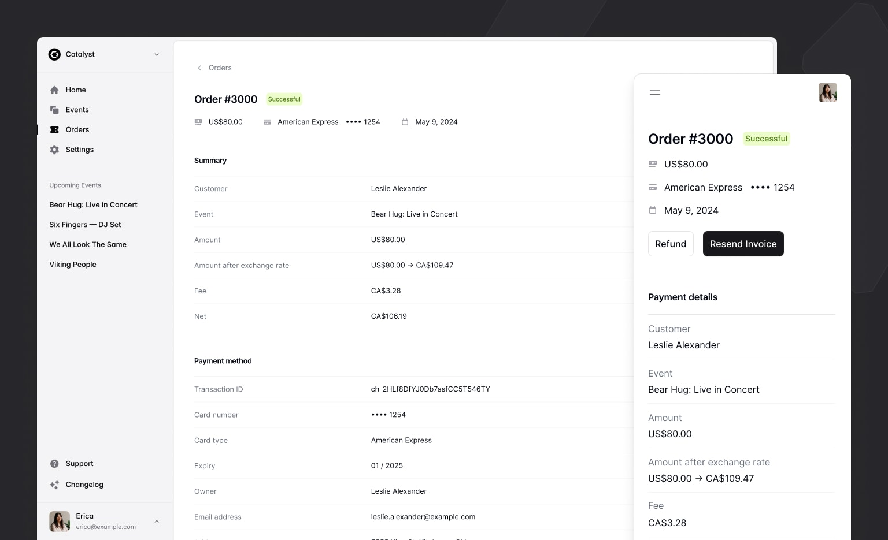
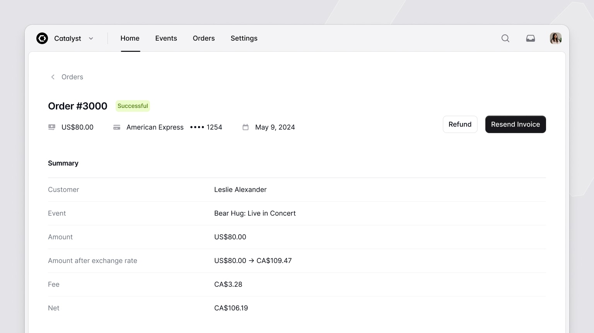
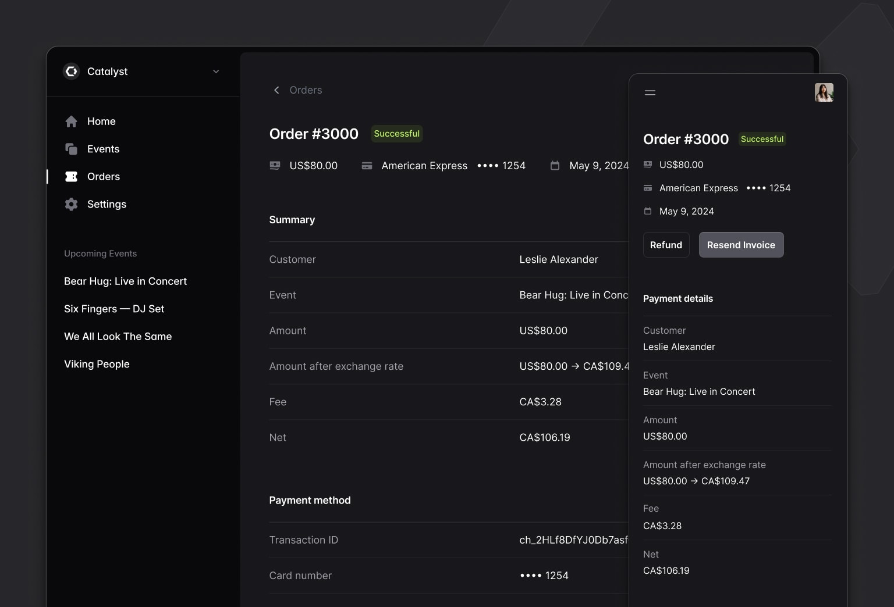

import { adamwathan } from '@/authors'
import card from './card.jpg'

export const meta = {
  title: 'Catalyst: Application layouts, navigation menus, description lists, and more',
  description: 'We just published the first major update to Catalyst since releasing the development preview, with two new application layouts, navbar and sidebar components, description lists, and more.',
  date: '2024-05-24T20:00:00.000Z',
  authors: [adamwathan],
  image: card,
}

{/*excerpt*/}

We just published the first major update to Catalyst since releasing the development preview, with two new application layouts, navbar and sidebar components, description lists, and more.

{/*/excerpt*/}



We just published the first major update to [Catalyst](https://tailwindui.com/templates/catalyst) since releasing the development preview, with two new application layouts, navbar and sidebar components, description lists, and more.

We're also pumped to share that with the release of [Headless UI v2.0 for React](/blog/headless-ui-v2), Catalyst is no longer in development preview — **it's officially stable** and you can start using it in production today without worrying about breaking changes in the underlying dependencies.

Check out our brand new [live demo site](https://catalyst-demo.tailwindui.com) to see what a full Catalyst project looks and feels like after these updates for yourself.

---

## New application layout components

One of the hardest things about trying to get started on a new project idea is getting past the blank canvas so you can actually start building something.

In this update we've added two new application layout components to make it easy to give your project a shape and structure so you have something you can start building with.

The first layout is a classic [sidebar layout](https://catalyst.tailwindui.com/docs/sidebar-layout), that moves the sidebar into a collapsible mobile menu on smaller screens:

<div className="mb-0">

[](https://catalyst.tailwindui.com/demos/sidebar)

</div>

```jsx  {{ style: 'plain' }}
import { SidebarLayout } from '@/components/sidebar-layout'
import { Navbar } from '@/components/navbar'
import { Sidebar } from '@/components/sidebar'

function Example({ children }) {
  return (
    <SidebarLayout
      sidebar={<Sidebar>{/* Sidebar menu */}</Sidebar>}
      navbar={<Navbar>{/* Navbar for mobile screens */}</Navbar>}
    >
      {/* Your page content */}
    </SidebarLayout>
  )
}
```

The second is a simpler [stacked layout](https://catalyst.tailwindui.com/docs/stacked-layout) with a horizontal navigation menu, which is often a great fit for apps with fewer pages:

<div className="mb-0">

[](https://catalyst.tailwindui.com/demos/stacked)

</div>

```jsx  {{ style: 'plain' }}
import { StackedLayout } from '@/components/stacked-layout'
import { Navbar } from '@/components/navbar'
import { Sidebar } from '@/components/sidebar'

function Example({ children }) {
  return (
    <StackedLayout
      navbar={<Navbar>{/* Top navigation menu */}</Navbar>}
      sidebar={<Sidebar>{/* Sidebar content for mobile menu */}</Sidebar>}
    >
      {/* Your page content */}
    </StackedLayout>
  )
}
```

And they both support dark mode too, of course:



We worked really hard to get the APIs for all of these components right, making it easy to position things where you need them to be, optionally include icons, incorporate dropdown menus, and more.

The final result turned out feeling really simple which is exactly what we were going for, and I think you'll find they are a real delight to build with.

Check out the [Sidebar layout documentation](https://catalyst.tailwindui.com/docs/sidebar-layout) and [Stacked layout documentation](https://catalyst.tailwindui.com/docs/stacked-layout) to get started, then dig into the [Navbar](https://catalyst.tailwindui.com/docs/navbar) and [Sidebar](https://catalyst.tailwindui.com/docs/sidebar) components to learn how to structure all of the navigation items.

---

## Description lists

When we were working on the application layouts we realized we didn't have any great content to demo them with, so we cooked up a `DescriptionList` component to fill in that big empty space.

<Example p='none'>
  <div class="bg-white p-8 dark:bg-slate-900">
    <dl
      class="grid grid-cols-1 text-base/6 sm:grid-cols-[min(50%,theme(spacing.80))_auto] sm:text-sm/6"
    >
      <dt
        class="col-start-1 border-t border-zinc-950/5 dark:border-white/5 pt-3 text-zinc-500 first:border-none sm:border-t sm:border-zinc-950/5 sm:dark:border-white/5 sm:py-3 dark:text-zinc-400"
      >
        Customer
      </dt>
      <dd
        class="pb-3 pt-1 text-zinc-950 sm:border-t sm:border-zinc-950/5 sm:dark:border-white/5 sm:py-3 dark:text-white sm:[&:nth-child(2)]:border-none"
      >
        Michael Foster
      </dd>
      <dt
        class="col-start-1 border-t border-zinc-950/5 dark:border-white/5 pt-3 text-zinc-500 first:border-none sm:border-t sm:border-zinc-950/5 sm:dark:border-white/5 sm:py-3 dark:text-zinc-400"
      >
        Event
      </dt>
      <dd
        class="pb-3 pt-1 text-zinc-950 sm:border-t sm:border-zinc-950/5 sm:dark:border-white/5 sm:py-3 dark:text-white sm:[&:nth-child(2)]:border-none"
      >
        Bear Hug: Live in Concert
      </dd>
      <dt
        class="col-start-1 border-t border-zinc-950/5 dark:border-white/5 pt-3 text-zinc-500 first:border-none sm:border-t sm:border-zinc-950/5 sm:dark:border-white/5 sm:py-3 dark:text-zinc-400"
      >
        Amount
      </dt>
      <dd
        class="pb-3 pt-1 text-zinc-950 sm:border-t sm:border-zinc-950/5 sm:dark:border-white/5 sm:py-3 dark:text-white sm:[&:nth-child(2)]:border-none"
      >
        $150.00 USD
      </dd>
      <dt
        class="col-start-1 border-t border-zinc-950/5 dark:border-white/5 pt-3 text-zinc-500 first:border-none sm:border-t sm:border-zinc-950/5 sm:dark:border-white/5 sm:py-3 dark:text-zinc-400"
      >
        Amount after exchange rate
      </dt>
      <dd
        class="pb-3 pt-1 text-zinc-950 sm:border-t sm:border-zinc-950/5 sm:dark:border-white/5 sm:py-3 dark:text-white sm:[&:nth-child(2)]:border-none"
      >
        US$150.00 → CA$199.79
      </dd>
      <dt
        class="col-start-1 border-t border-zinc-950/5 dark:border-white/5 pt-3 text-zinc-500 first:border-none sm:border-t sm:border-zinc-950/5 sm:dark:border-white/5 sm:py-3 dark:text-zinc-400"
      >
        Fee
      </dt>
      <dd
        class="pb-3 pt-1 text-zinc-950 sm:border-t sm:border-zinc-950/5 sm:dark:border-white/5 sm:py-3 dark:text-white sm:[&:nth-child(2)]:border-none"
      >
        $4.79 USD
      </dd>
      <dt
        class="col-start-1 border-t border-zinc-950/5 dark:border-white/5 pt-3 text-zinc-500 first:border-none sm:border-t sm:border-zinc-950/5 sm:dark:border-white/5 sm:py-3 dark:text-zinc-400"
      >
        Net
      </dt>
      <dd
        class="pb-3 pt-1 text-zinc-950 sm:border-t sm:border-zinc-950/5 sm:dark:border-white/5 sm:py-3 dark:text-white sm:[&:nth-child(2)]:border-none"
      >
        $1,955.00
      </dd>
    </dl>
  </div>
</Example>

```jsx  {{ style: 'plain' }}
import { DescriptionDetails, DescriptionList, DescriptionTerm } from '@/components/description-list'

function Example() {
  return (
    <DescriptionList>
      <DescriptionTerm>Customer</DescriptionTerm>
      <DescriptionDetails>Michael Foster</DescriptionDetails>

      <DescriptionTerm>Event</DescriptionTerm>
      <DescriptionDetails>Bear Hug: Live in Concert</DescriptionDetails>

       {/* ... */}
    </DescriptionList>
  )
}
```

It's a really simple API that works just like the HTML `<dl>` element, but is nicely styled, responsive, and with dark mode support of course.

Check out the [Description list](https://catalyst.tailwindui.com/docs/description-list) documentation for more details.

---

## Page headings

More components we needed to make the demo look good! We've added `Heading` and `Subheading` components you can use to quickly and consistently title things in your UI.

<Example p="none">
  <div class="p-8 bg-white dark:bg-zinc-900">
    <div>
      <h1 class="text-2xl/8 font-semibold text-zinc-950 sm:text-xl/8 dark:text-white">Heading</h1>
    </div>
    <div class="mt-4">
      <h2 class="text-base/7 font-semibold text-zinc-950 sm:text-sm/6 dark:text-white">Subheading</h2>
    </div>
  </div>
</Example>

```jsx  {{ style: 'plain' }}
import { Heading, Subheading } from '@/components/heading'

function Example() {
  return (
    <div>
      <Heading>Heading</Heading>
      <Subheading>Subheading</Subheading>
    </div>
  )
}
```

You can control which HTML heading element is rendered using the `level` prop, and like everything else, they're responsive with built-in dark mode support.


See the [Heading](https://catalyst.tailwindui.com/docs/heading) documentation for more examples.

---

## Dividers

Saved the best for last — Catalyst now includes a gray line you can put in between things.

<Example p="none">
  <div class="px-8 py-16 bg-white dark:bg-zinc-900">
    <hr class="w-full border-t border-zinc-950/10 dark:border-white/10" />
  </div>
</Example>

```jsx  {{ style: 'plain' }}
import { Divider } from '@/components/divider'

function Example() {
  return <Divider />
}
```

We worked tirelessly on this one, and are so proud to make this part of your application development process easier.

Check out the [Divider](https://catalyst.tailwindui.com/docs/divider) documentation — it does have one prop at least.

---

Catalyst is included with your Tailwind UI all-access license at no additional cost, so if you've got a license, log in and [download the latest version](https://tailwindui.com/templates/catalyst) to start building.

Looking forward to seeing what you do with it!
