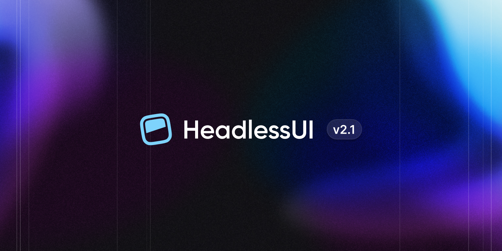

import { adamwathan, reinink } from '@/authors'
import card from './card.jpg'
import { WhitespaceDemo, DuplicationDemo } from '@/components/PrettierPluginWhitespaceDemos.js'

export const meta = {
  title: 'Headless UI v2.1: New transition API and sibling dialogs',
  description: '',
  date: '2024-06-20T16:30:00.000Z',
  authors: [adamwathan, reinink],
  image: card,
}

{/*excerpt*/}

We just released Headless UI v2.1 for React, which adds a new data-attribute based transition API and support for sibling dialogs.

{/*/excerpt*/}



We just released Headless UI v2.1 for React, which adds a new data-attribute based transition API and support for sibling dialogs.

---

## New transition API

One great addition to Headless UI v2.0 was the new `data-*` state attributes, which provide information about the state of a given component. These data attributes combine really well with Tailwind's [data attribute modifier](/docs/hover-focus-and-other-states#data-attributes), as you can conditionally apply styles based on their presence.

For example, you can add a light blue background to a `MenuItem` when it's focused:

```jsx {{ style: 'framed', color: 'pink' }}
<MenuItem>
  <a href="/settings" className="data-[focus]:bg-blue-100">Settings</a>
</MenuItem>
```

By comparison, here's how you previously had to conditionally apply this style:

```jsx {{ style: 'framed', color: 'indigo' }}
<MenuItem>
  {({ focus }) => (
    <a href="/settings" className={focus && 'bg-blue-100'}>Settings</a>
  )}
</MenuItem>
```

Using data attributes is much simpler, as you no longer need the render prop or the conditional logic in the `className` prop. Plus, if you're using server components (RSC), the render prop approach does not work as functions can't be serialized by React.

We love using data attributes so much that we thought, "What if we could do the same for the transition API?"

Well, we did it, and it's beautiful:

```jsx {{ style: 'framed', color: 'fuchsia' }}
  import { Menu, MenuButton, MenuItem, MenuItems } from '@headlessui/react'

  function Example() {
    return (
      <Menu>
        <MenuButton>My account</MenuButton>
        <MenuItems
>         transition
>         className="transition duration-200 ease-out data-[closed]:scale-95 data-[closed]:opacity-0"
        >
          {/* Menu items... */}
        </MenuItems>
      </Menu>
    )
  }
```

Previously, you had to do this:

```jsx {{ style: 'framed', color: 'indigo' }}
  import { Menu, MenuButton, MenuItem, MenuItems, Transition } from '@headlessui/react'

  function Example() {
    return (
      <Menu>
        <MenuButton>My account</MenuButton>
>       <Transition
>         enter="duration-200 ease-out"
>         enterFrom="scale-95 opacity-0"
>         enterTo="scale-100 opacity-100"
>         leave="duration-300 ease-out"
>         leaveFrom="scale-100 opacity-100"
>         leaveTo="scale-95 opacity-0"
>       >
>         <MenuItems anchor="bottom" className="origin-top transition">
            {/* Menu items... */}
          </MenuItems>
>       </Transition>
      </Menu>
    )
  }
```

Just a smidge less verbose.

Headless UI v2.1 introduces four new transition data attributes that can be used to style the element at different stages of the transition:

- `data-closed`: Present right before transitioning in, or when transitioning out.
- `data-enter`: Present when the element is transitioning in.
- `data-leave`: Present when the element is transitioning out.
- `data-transition`: Present when the element is transitioning in or out.

In many cases, all you need is the `data-closed` attribute, but the others are available for more complex situations, like when you want different enter and leave transitions.

To learn more see the updated [transition documentation](https://headlessui.com/react/transition).

---

## Sibling dialog support

We heard you, and with Headless UI v2.1 you can now *finally* have multiple sibling dialogs open at the same time.

Previously, this was only possible by nesting the dialogs within each other:

```jsx
<DeleteAccountDialog>
  <ConfirmPasswordDialog />
</DeleteAccountDialog>
```

But now they can be siblings, rendered from anywhere in your app:

```jsx
<DeleteAccountDialog />
<ConfirmPasswordDialog />
```

Whatever `Dialog` is opened last is considered to be the top-most dialog, and pressing escape or clicking outside of a dialog will only close the top-most one, regardless of where it was rendered.

What can I say except, "You're welcome"?

---

To start using these improvements in your projects, just install the latest version:

```sh
$ npm i @headlessui/react@latest
```

If you run into any issues, let us know on [GitHub](https://github.com/tailwindlabs/headlessui)!
