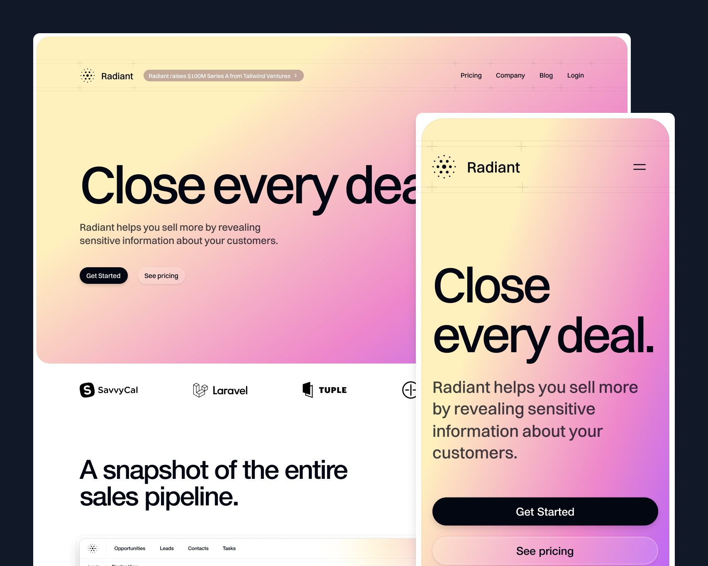

import { adamwathan } from '@/authors'
import twitterCard from './twitter-card.png'

export const meta = {
  title: 'Welcome to Radiant: A stunning Sanity powered SaaS template',
  description: `Over the past couple of months we’ve been working away at a new SaaS template called Radiant and it’s out now as part of Tailwind UI.`,
  date: '2024-09-05T10:30:00.000Z',
  authors: [adamwathan],
  image: twitterCard,
}

{/*excerpt*/}

Over the past couple of months we’ve been working away at a new SaaS template called [Radiant](https://tailwindui.com/templates/radiant) and it’s out now as part of Tailwind UI.


{/*/excerpt*/}


We just wrapped up work on a stunning new Sanity powered SaaS template called [Radiant](https://tailwindui.com/templates/radiant) and it's out now as part of Tailwind UI.

[](https://tailwindui.com/templates/radiant)


It’s built with Next.js, Sanity and, of course, Tailwind CSS. This is the first time we’ve used a third party Content Management System in a template. 

The trickiest part of designing a SaaS template like this, is coming up with interactive elements that people can apply to their own product without too much effort. They need to be generalizable without being super generic.

The best way to do this is to come up with a product idea first. A few months back when we were doing a lot of hiring, Steve did some designs for a hiring platform that had this kanban style interface. That idea morphed into a CRM because it’s easier to poke fun at sales people than people trying to get a job. From there we came up with some core graphical elements that a product like this might have. Things like a map with pins, a logo cluster, a keyboard and a scrolling integrations timeline. We put a lot of effort into making these elements reusable and easy to customize.

Check out the live preview as always for the full experience — there are tons of cool details in this one that you have to see in the browser to really appreciate.

---

## Tastefully interactive

Having some interactive animations is basically table stakes for a SaaS landing page these days but we really tried to keep things tasteful and not go overboard.

<div className="relative rounded-2xl overflow-hidden">
  <div className="absolute inset-0 rounded-2xl ring-1 ring-inset ring-slate-900/10 pointer-events-none"></div>
  <video src="/tastefully_animated.mp4" autoPlay playsInline loop muted className="block m-0" />
</div>

We used Framer Motion to animate the bento cards on hover but it can be a bit annoying to pass a hover state down to each child element. We ended up leveraging Framer's variant propagation to make this work - a hover event triggers a variant change in the parent that propagates down to the children because they share the same variant keys. 

```jsx {{}}
export function BentoCard({
  graphic,
  ...
}: {
  graphic: React.ReactNode
  ...
}) {
  return (
  <motion.div
      initial="idle"
      whileHover="active"
      variants={{ idle: {}, active: {} }}
      data-dark={dark ? 'true' : undefined}
    >
      <div className="relative h-80 shrink-0">
        {graphic}
      </div>
      <div className="relative p-10">
        <Subheading as="h3" dark={dark}>
          {eyebrow}
        </Subheading>
        <p className="mt-1 text-2xl/8 font-medium tracking-tight text-gray-950 group-data-[dark]:text-white">
          {title}
        </p>
        <p className="mt-2 max-w-[600px] text-sm/6 text-gray-600 group-data-[dark]:text-gray-400">
          {description}
        </p>
      </div>
    </motion.div>
  )
}
```

```jsx {{filename: 'map.tsx'}}
function Marker({
  src,
  top,
  offset,
  delay,
}: {
  src: string
  top: number
  offset: number
  delay: number
}) {
  return (
    <motion.div
      variants={{
        idle: { scale: 0, opacity: 0, rotateX: 0, rotate: 0, y: 0 },
        active: { y: [-20, 0, 4, 0], scale: [0.75, 1], opacity: [0, 1] },
      }}
      transition={{ duration: 0.25, delay, ease: 'easeOut' }}
      style={{ '--offset': `${offset}px`, top } as React.CSSProperties}
      className="absolute left-[calc(50%+var(--offset))] size-[38px] drop-shadow-[0_3px_1px_rgba(0,0,0,.15)]"
    >
    ...
    </motion.div>
  )
}
...
```

There is no difference between the variants in the parent so they don't actually change but the children still get the hover event, even if they are deeply nested. It's a bit of a hack but it's a nice way to pass the hover event down without the need for another hook.

<div className="relative rounded-2xl overflow-hidden">
  <div className="absolute inset-0 rounded-2xl ring-1 ring-inset ring-slate-900/10 pointer-events-none"></div>
  <video src="/logo-timeline.mp4" autoPlay playsInline loop muted className="block m-0" />
</div>

The logo timeline animation is a bit different, because we wanted the logos to stay in their new position when the hover ends, rather than return to their original position. You could use Framer to do this but we ended up using a CSS only approach that's a bit more ergonomic. 

It exploits the fact that you can set a negative `animation-delay` value to offset the start position of the element. That way all the logos share the same animation keyframes but they can start at different positions and have different durations.

```css {{filename: 'tailwind.css'}}
@tailwind base;
@tailwind components;
@tailwind utilities;

@keyframes move-x {
  0% {
    left: var(--move-x-from);
  }
  100% {
    left: var(--move-x-to);
  }
}
```

```jsx {{filename: 'logo-timeline.tsx'}}
function Logo({
  label,
  src,
  className,
}: {
  label: string
  src: string
  className: string
}) {
  return (
    <div
      className={clsx(
        'absolute top-1/2 grid -translate-x-1/2 -translate-y-1/2 grid-cols-[1rem,1fr] items-center gap-2 whitespace-nowrap px-3 py-1',
        'rounded-full bg-gradient-to-t from-gray-800 from-50% to-gray-700 ring-1 ring-inset ring-white/10',
        '[--move-x-from:-25%] [--move-x-to:150%] [animation-iteration-count:infinite] [animation-name:move-x] [animation-play-state:paused] [animation-timing-function:linear] group-hover:[animation-play-state:running]',
        className,
      )}
    >
      
      <span className="text-sm/6 font-medium text-white">{label}</span>
    </div>
  )
}

export function LogoTimeline() {
  return (
    ...
    <Row>
      <Logo
        label="Loom"
        src="./logo-timeline/loom.svg"
        className="[animation-delay:-26s] [animation-duration:30s]"
      />
      <Logo
        label="Gmail"
        src="./logo-timeline/gmail.svg"
        className="[animation-delay:-8s] [animation-duration:30s]"
      />
    </Row>
    ...
```


---

## Deliberately reusable

There's nothing worse than buying a template and realizing that it's so specific to the example content that you can't actually use it for your own project. We spent a lot of time making sure these interactive graphics were easy to re-purpose. 

The logo cluster, for example, has a simple API that lets you pass in your own logos and tweak the hover animation to match. 


```jsx
export function LogoCluster() {
  return (
    <div className="relative h-full overflow-hidden" aria-hidden="true">
      <Circles />
      <div className="absolute left-1/2 h-full w-[26rem] -translate-x-1/2">
        <MainLogo />
        <Logo
          src="./logo-cluster/career-builder.svg"
          left={360}
          top={144}
          hover={{ x: 6, y: 1, rotate: 5, delay: 0.38 }}
        />
        <Logo
          src="./logo-cluster/dribbble.svg"
          left={285}
          top={20}
          hover={{ x: 4, y: -5, rotate: 6, delay: 0.3 }}
        />
        ...
      </div>
    </div>
  )
}

```

The keyboard shortcuts section is another good example. We wanted to make it easy to add your own shortcuts, so we built the whole thing in code. Adding your own shortcuts is as simple as passing an array of key names to the Keyboard component and because each key is a component, you can easily add custom keys or change the layout.


```jsx
<div className="flex size-full pl-10 pt-10">
  <Keyboard highlighted={['LeftCommand', 'LeftShift', 'D']} />
</div>
```


---

## Powerful Sanity integration

The Radiant blog is powered by Sanity, the first time we've used a third party CMS in a template. It comes with a bunch of advantages over just using markdown files, like the ability to collaborate on drafts, and a more structured content model.

With Sanity you get the benefits of a CMS but with the same flexibility that you would get with MDX. You define components for different types of blocks, marks, and lists by passing them into the `PortableText` component. It makes it super easy to define typography styles and render custom components, like the separator we we're using here.

```jsx
export default async function BlogPost({
  params,
}: {
  params: { slug: string }
}) {
  let post = (await getPost(params.slug)) || notFound()

  return (
    <main className="overflow-hidden">
      ... 
      {post.body && (
        <PortableText
          value={post.body}
          components={{
            block: {
              normal: ({ children }) => (
                <p className="mb-10 mt-10 text-base/8 first:mt-0 last:mb-0">
                  {children}
                </p>
              ),
              h2: ({ children }) => (
                <h2 className="mb-10 mt-12 text-2xl/8 font-medium tracking-tight text-gray-950 first:mt-0 last:mb-0">
                  {children}
                </h2>
              ),
              h3: ({ children }) => (
                <h3 className="mb-10 mt-12 text-xl/8 font-medium tracking-tight text-gray-950 first:mt-0 last:mb-0">
                  {children}
                </h3>
              ),
              blockquote: ({ children }) => (
                <blockquote className="mb-10 mt-10 border-l-2 border-l-gray-300 pl-6 text-base/8 text-gray-950 first:mt-0 last:mb-0">
                  {children}
                </blockquote>
              ),
            },
            types: {
              image: ({ value }) => (
                
              ),
              separator: ({ value }) => {
                switch (value.style) {
                  case 'line':
                    return (
                      <hr className="my-8 border-t border-gray-200" />
                    )
                  case 'space':
                    return <div className="my-8" />
                  default:
                    return null
                }
              },
            },
            ...
          }}
        />
      )}
      ...
    </main>
  )
}
```

Another thing that Sanity makes much easier is handling images. Controlling the size, quality, and format of the images is as simple as passing a few parameters to the image builder.  

```jsx
<div>
  <div className="text-sm/5 max-sm:text-gray-700 sm:font-medium">
    {dayjs(post.publishedAt).format('dddd, MMMM D, YYYY')}
  </div>
  {post.author && (
    <div className="mt-2.5 flex items-center gap-3">
      {post.author.image && (
        
      )}
      <div className="text-sm/5 text-gray-700">
        {post.author.name}
      </div>
    </div>
  )}
</div>
```

We've set the template up with some seed data so you can see how it all works without having to write your own posts - but it's easy to swap out the data with your own and get started with your own blog.

---

And that's [Radiant](https://tailwindui.com/templates/studio)! Have a look under the hood, kick the tires, and let us know what you think.

Like all of our templates, it's included with a one-time purchase [Tailwind UI all-access](https://tailwindui.com/all-access) license, which is the best way to support our work on Tailwind CSS and make it possible for us to keep building awesome stuff for years to come.
