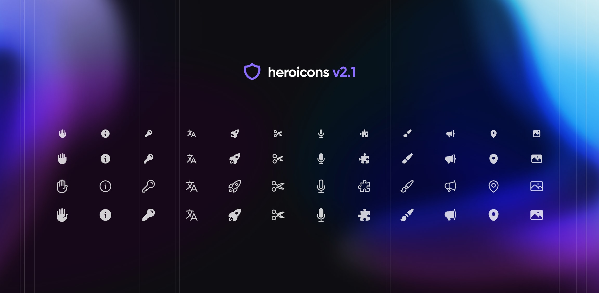
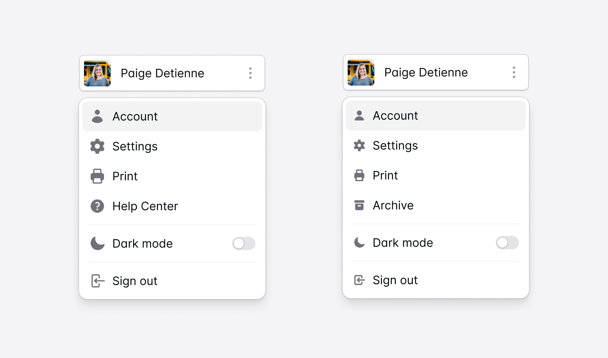

import { adamwathan } from '@/authors'
import card from './card.jpg'

export const meta = {
  title: 'Heroicons Micro: What are these, icons for ants?',
  description: `We just released Heroicons v2.1 which includes a brand new micro style — a full set of almost three hundred 16×16 icons designed for tighter, higher density UIs.`,
  date: '2023-12-17T15:00:00.000Z',
  authors: [adamwathan],
  image: card,
}

We just released [Heroicons v2.1](https://heroicons.com) which includes a brand new micro style — a full set of almost three hundred 16&times;16 icons designed for tighter, higher density UIs.

We've wanted to do a set this size for a long time, but it wasn't until we started working on [a new React UI kit project](https://twitter.com/steveschoger/status/1725246591269769363) earlier this year that we finally needed them badly enough to bite the bullet and design them.

In Catalyst (our new UI kit), we've tried to really thread the needle in terms of giving things enough room to breathe but also keeping things dense enough that the applications you build with it actually feel productive to use.

We're using lots of 14px text which looks great in the UI, but when we tried to incorporate our existing 20×20 icons, they felt just a tiny bit too big and unbalanced.

Most people would have probably just scaled the icons down and moved on, but we're not most people, for better or for worse.

Icons always turn out a lot sharper when you design them for the exact size they're going to be used, so we redrew every icon from scratch, carefully trimming down the amount of detail on an icon-by-icon basis to make sure they render nice and crisp at their intended size.

_Insert some image comparing a few 20px icons to 16px icons, maybe annotating examples of where the details were simplified?_

About a month later we had a brand new set of 288 icons, meticulously crafted for higher density interfaces like what we've been working on with Catalyst.

_Insert image of the entire micro set_

You can check out all of the new icons on the [Heroicons website](https://heroicons.com), start designing with them using our official [Heroicons Figma library](https://www.figma.com/community/file/958423903283802665/heroicons), and add them to your projects with our [React and Vue libraries](https://github.com/tailwindlabs/heroicons).
