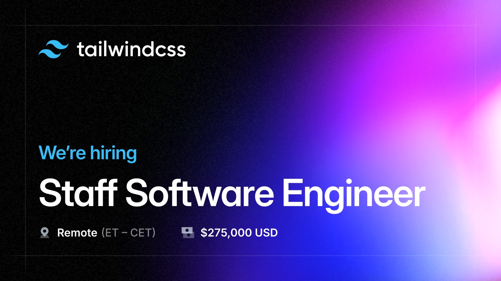

import { adamwathan } from '@/authors'
import card from './card.jpg'

export const meta = {
  title: "We're hiring a Design Engineer + Staff Engineer",
  description: `We just tagged the first public v4.0.0-alpha so you can start experimenting with it and help us get to a stable release later this year.`,
  date: '2024-03-19T18:00:00.000Z',
  authors: [adamwathan],
  image: card,
}

{/*excerpt*/}

We're hiring a Design Engineer and Staff Software Engineer to work on some ambitious new projects with us. Both roles are fully remote, with a salary of $275,000 USD.

{/*/excerpt*/}

We're hiring a [Design Engineer](/careers/design-engineer) and [Staff Software Engineer](/careers/staff-software-engineer) to work on some ambitious new projects with us.

We're small on purpose, and we take a lot of pride in punching above our weight. We're six people, but Tailwind CSS is installed over 30 million times per month, and is used by the world's biggest companies to build the world's best websites.

We're independent and profitable, and we do this because it's fun. We're in this to enjoy the actual work we do every day, not to grind it out in hopes of a big exit in the future.

If this sounds like the sort of place you'd like to work, we'd love to hear from you.

---

## Design Engineer

We're hiring a [Design Engineer](/careers/design-engineer) to build ambitious interfaces, prototype new ideas, and push the boundaries of what's possible with Tailwind CSS.

You'd be responsible for things like:

- **Design and build ambitious marketing websites** for our open-source projects, commercial products, and events like Tailwind Connect.
- **Design and prototype new features for Tailwind CSS** to make sure we're always using the full potential of the platform.
- **Create new components and templates for Tailwind UI**, taking them all the way from initial concept to shipped.
- **Enhance our documentation with visual demos** to make it easy for people to understand and apply complex CSS features in their work.
- **Teach and inspire our audience** by breaking down interesting things you design and build as articles and social media posts.

Here are some real examples of projects you would have worked on in the last few months:

- **Design and build the [Tailwind Connect](https://connect.tailwindcss.com/) microsite** — including coming up with a unique Markdown-driven badge design experience.
- **Craft the [first components](https://catalyst.tailwindui.com/docs/dialog) for Catalyst** — our first fully-componentized React UI kit.
- **Build a tool for capturing videos for our [Showcase](https://tailwindcss.com/showcase) site** — to automate creating preview videos that feel like a real person scrolling through a site.
- **Build [interactive demos](https://tailwindcss.com/docs/height#dynamic-viewport-height) to explain dynamic viewport units** — to include in the documentation along with the release of Tailwind CSS v3.4.

After you start, you'd work on upcoming projects like:

- **Design and build an interactive microsite for the Tailwind CSS v4.0 release** with thoughtfully crafted demos that communicate the most important improvements in a visual way.
- **Prototype APIs for scroll-driven animations in Tailwind CSS**, finding the right balance between simplicity and flexibility, and making our users feel like they have superpowers.
- **Explore new color palettes with automatic dark mode support**, carefully figuring out the right abstractions for different levels of hierarchy that apply universally to different projects.
- **Research and design text-shadow support for Tailwind CSS**, finally.

This is a fully remote position with a salary of **$275,000 USD**, open to candidates in the Eastern (UTC-5) to Central European (UTC+1) timezones.

[Learn more about this role and apply &rarr;](/careers/design-engineer)

---

## Staff Software Engineer

We're hiring a [Staff Software Engineer](/careers/staff-software-engineer) to work on Tailwind CSS, Headless UI, and our supporting ecosystem of tools like the Tailwind CSS IntelliSense extension for VS Code.

You'd have a wide range of responsibilities, including:

- **Build and document new features** for projects like Tailwind CSS and Headless UI.
- **Contribute improvements to upstream projects** like Lightning CSS, Next.js, and Vite.
- **Maintain CI workflows and automations** for running tests and building releases.
- **Manage issues and contributions** from the community to our open-source repositories.
- **Define and uphold engineering standards** with a focus on code quality, performance, and documentation, to make sure we're always shipping work we can be proud of.
- **Manage project priorities and adjust scope** to meet project deadlines without sacrifing on top-level goals.

Here are some real examples of projects you would have worked on in the last few months:

- **Create a [Rust library](https://github.com/tailwindlabs/tailwindcss/blob/0ee3508179966a767b7802a7262bb9d4ce2221da/oxide/crates/core/src/lib.rs) for extracting utility class names** — a tool that can scan an entire directory of template files as fast as possible and extract potential class names in parallel.
- **Write a [fast CSS parser](https://github.com/tailwindlabs/tailwindcss/blob/0ee3508179966a767b7802a7262bb9d4ce2221da/packages/tailwindcss/src/css-parser.ts) in TypeScript** — to parse only the exact amount of detail needed by Tailwind's internals, looking for domain-specific shortcuts to make it significantly faster than existing libraries for our needs.
- **Fix an issue with [scroll-locking](https://github.com/tailwindlabs/headlessui/pull/2891) in Headless UI** — to make sure scrollable elements in dialogs can still be scrolled on iOS.
- **Campaign for [new APIs](https://github.com/vitejs/vite/pull/16135) we need in Vite** — prepare a compelling argument for improvements we need to support Tailwind CSS and collaborate with the Vite core team to prototype a solution.

After you start, you'd work on upcoming projects like:

- **Develop a Tailwind CSS bundler plugin for Next.js** — to generate your CSS using the module graph instead of scanning the file system, working with our contacts at Vercel to get it right.
- **Design a set of IDE integration APIs for Tailwind CSS** — first-class, stable, documented APIs that editor teams like JetBrains can rely on to add things like completions, lint warnings, class sorting, and more to their tools.
- **Design, build, and document a Tooltip component for Headless UI** — making sure it's fully accessible, with a flexible but delightful API.
- **Build a backwards compatibility layer for Tailwind CSS v4.0** — re-introduce support for JavaScript configuration files, explore codemod tooling, and make sure existing community plugins are as compatible as possible with the new engine.

This is a fully remote position with a salary of **$275,000 USD**, open to candidates in the Eastern (UTC-5) to Central European (UTC+1) timezones.

[Learn more about this role and apply &rarr;](/careers/staff-software-engineer)
