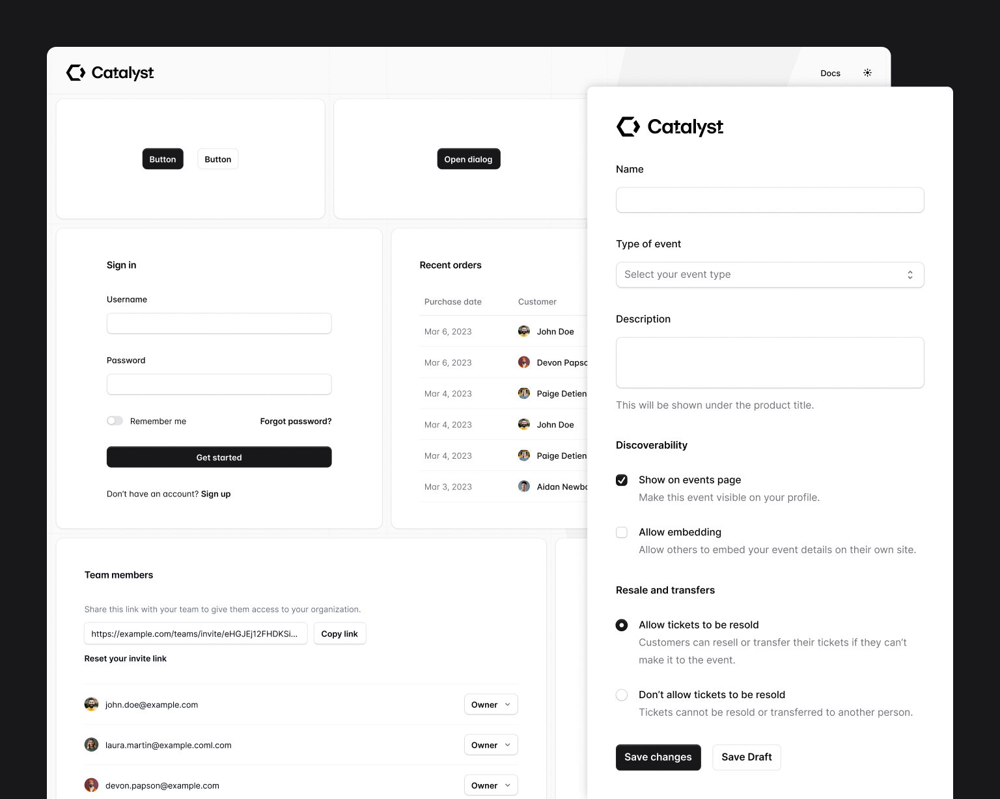
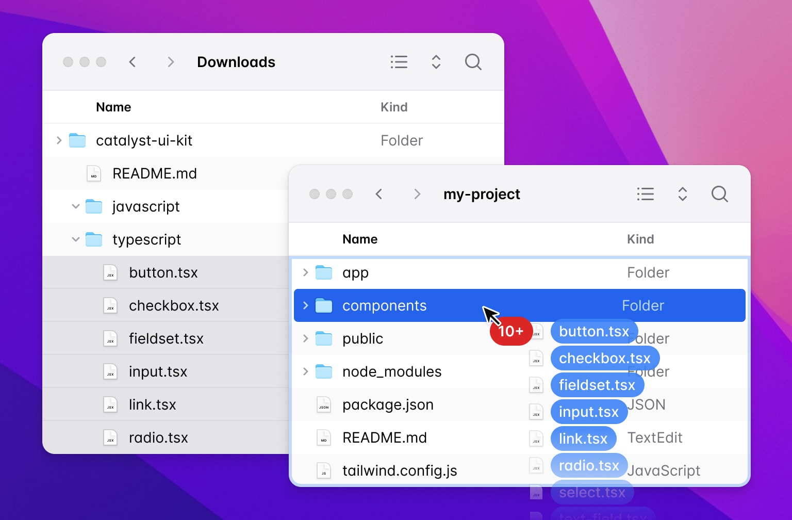
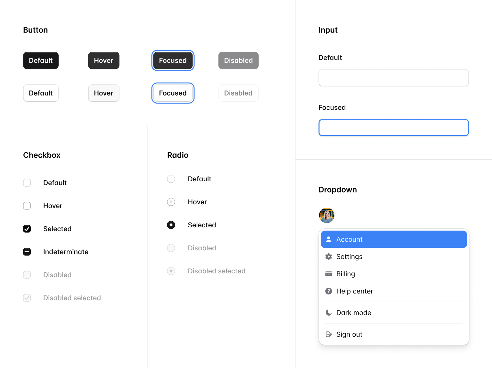
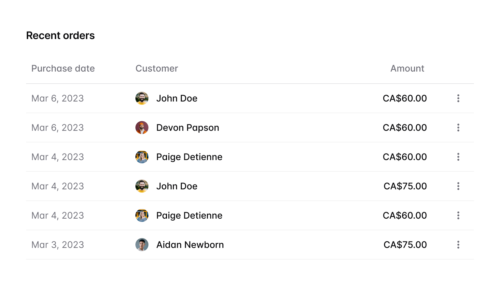

import { adamwathan } from '@/authors'
import card from './card.png'
import video from './catalyst-switch.mp4'


export const meta = {
  title: "Introducing Catalyst: A modern UI kit for React",
  description: `We just released the first development preview of Catalyst, our new fully-componentized, batteries-included application UI kit for React.`,
  date: '2023-12-20T20:00:00.000Z',
  authors: [adamwathan],
  image: card,
}


{/*excerpt*/}

Today's the day — we just published the first development preview of Catalyst, our first fully-componentized, batteries-included application UI kit for React, just in time for your holiday hacking sessions.

{/*/excerpt*/}

Today's the day — we just published the first development preview of [Catalyst](https://tailwindui.com/templates/catalyst), just in time for your holiday hacking sessions.



**Catalyst is our first fully-componentized, batteries-included application UI kit** — real React components with thoughtfully designed APIs that build on each other to create a real component architecture, the same way we'd do it in a real application.

Check out the [live demo](https://catalyst.tailwindui.com), read the [documentation](https://catalyst.tailwindui.com/docs), and if you're a Tailwind UI All-Access customer, [download it](https://tailwindui.com/templates/catalyst/download) and try it out in a new project today.

**Catalyst is currently in development preview** and there's a lot more to come, but we're releasing it today so you can play with it right away as we continue to build new components and find ways to make it an even better experience.


---

## Your components, not ours

With Catalyst, we set out to build a UI kit that tomorrow's Stripe or Linear would feel good about using to build their products — design-obsessed teams who want to own their UI components, and would never choose an off-the-shelf library.

So it's not a dependency you install, instead you download the source and copy the components into your own project where they become the starting point for your own component system:



Want to change the border radius on your buttons? Just open `button.tsx` and change some classes. You don't need to open a GitHub issue and try to convince us to expose a new configuration option.

Catalyst is a "disappearing UI kit" — six months after you've installed it, you should almost forget it wasn't you who built the original components.

---

## Design is in the details

Getting the visual style right on a project like this is hard. We went into it with a few goals:

- **Be competitive** — we wanted to design something that could hold its own next to some of the nicest interfaces on the web today.
- **Be timeless** — we didn't want to design something that would look dated in 6 months because it leaned too hard into specific trends.
- **Be productive** — whatever we designed needed to feel fast and efficient to real users, not just look great in a Dribbble shot.

It took a lot of work and there were a lot of trade-offs to balance, but I'm really in love with where we ended up:



**To be competitive**, we invested in lots of details like subtle backdrop blurs on dropdown menus, perfecting the way shadows and borders blend with each other on form controls, and thoughtful use of animation in things like dialogs and toggle switches.


**To be timeless**, we tried to strike the right balance between flat and skeuomorphic design, with just enough depth cues that our components will look great even if the trends change a bit in either direction.


We also took inspiration from the browser, and used unopinionated blue focus rings to avoid picking a treatment that might soon look out of fashion.

**To be productive**, we worked carefully to make sure there was still plenty of whitespace, but that the UI was still dense enough to fit plenty of information on the screen.



We also limited our use of transitions and animations only to places where it felt important, and even then tried to keep them fast so it never feels like you're waiting on the UI.

<div className="my-8 relative rounded-2xl overflow-hidden">
  <div className="absolute inset-0 rounded-2xl ring-1 ring-inset ring-slate-900/10 pointer-events-none"></div>
  <video src={video} autoPlay playsInline loop muted className="block m-0"/>
</div>

**Catalyst also ships with full dark mode support**, and anything you build with Catalyst components automatically adapts between light and dark modes.


It's not obvious, but there are a ton of little details we had to change to make things look their best in dark mode, like adjusting shadows, changing outer rings to inner rings to mimic the change in lighting, and more.

---

## Modeled after HTML

We spent a _lot_ of time working on the component APIs, trying very hard to make things really easy to drop in and use right away, without compromising on flexibility.


It's common for UI libraries to use APIs like this:

```jsx {{ filename: 'JSX', style: 'framed', color: 'pink' }}
function Example() {
  return (
    <TextField
      name="product_name"
      label="Product name"
      description="Use the name you'd like people to see in their cart."
    />
  )
}
```

But with all the props living on the same component, it starts to get difficult to do things like add a class just to the `<input>` element itself.

Ultimately that led us to APIs that closely mirrored HTML, where it's rare that a single component renders more than one element.

Creating a text field with Catalyst looks like this for example:

```jsx {{ filename: 'JSX', style: 'framed', color: 'indigo' }}
import { Description, Field, Label } from '@/components/fieldset'
import { Input } from '@/components/input'

function Example() {
  return (
    <Field>
      <Label>Product name</Label>
      <Description>Use the name you'd like people to see in their cart.</Description>
      <Input name="product_name" />
    </Field>
  )
}
```

By keeping things composable like this, it makes it really easy to do things like constrain the width of the input, without constraining the width of any of the other elements:


```diff-jsx {{ filename: 'JSX', style: 'framed', color: 'fuchsia' }}
  import { Description, Field, Label } from '@/components/fieldset'
  import { Input } from '@/components/input'

  function Example() {
    return (
      <Field>
        <Label>Product name</Label>
        <Description>Use the name you'd like people to see in their cart.</Description>
-       <Input name="product_name" />
+       <Input name="product_name" className="max-w-sm" />
      </Field>
    )
  }
```

It also makes it easy to move the description _below_ the input, instead of above:

```diff-jsx {{ filename: 'JSX', style: 'framed', color: 'sky' }}
  import { Description, Field, Label } from '@/components/fieldset'
  import { Input } from '@/components/input'

  function Example() {
    return (
      <Field>
        <Label>Product name</Label>
-       <Description>Use the name you'd like people to see in their cart.</Description>
        <Input name="product_name" className="max-w-sm" />
+       <Description>Use the name you'd like people to see in their cart.</Description>
      </Field>
    )
  }
```

It took a lot of experimenting to figure out the right way to make these APIs work, especially around details like adding layout styles to the right children, but the payoff was worth it, and these components are really a delight to use.

---

## Powered by the next generation of Headless UI

We released the first version of [Headless UI](https://headlessui.com/) back in the summer of 2020, but it's been just over a year now since the last significant feature release because of all the work we've been focused on with Tailwind CSS itself.

Catalyst was the perfect excuse to get our hands dirty with Headless UI again, and we quickly found lots of ways to improve the project to simplify the code in Catalyst itself.

We just published Headless UI v2.0.0-alpha.1, which includes a ton of new stuff:

- **Built-in anchor positioning** — using [Floating UI](https://floating-ui.com/), components like `Menu`, `Listbox`, and more can now automatically position their popovers to be anchored to their trigger, adapting as needed to changes in the viewport.
- **Headless checkbox component** — we've added a headless `Checkbox` component to complement our existing `RadioGroup` component, making it easy to build totally custom checkbox controls.
- **HTML form components** — we've added `Input`, `Select`, `Textarea`, `Label`, `Description`, `Fieldset`, and `Legend` components that handle all of the ID generation and `aria-*` attribute mapping you need to do to connect form fields together.
- **Improved hover and focus-visible detection** — using hooks from the awesome [React Aria](https://react-spectrum.adobe.com/react-aria/hooks.html) library under the hood, Headless UI now adds smarter `data-hover` and `data-focus` attributes to your controls that behave more consistently across different devices than the native pseudo-classes.
- **Combobox list virtualization** — the next version of Headless UI can now handle giant lists of combobox options with no performance issues.

...with plenty of other improvements to come, including a date picker, tooltips, and more.

These improvements are React-only for now during this early alpha period, but we plan to bring all of these improvements to Vue as well before tagging v2.0.

We'll have documentation published for this stuff really soon, but couldn't resist getting Catalyst out before the holidays, even if it meant publishing the Headless UI docs a few days later.

---

## Try it out

[Catalyst](https://tailwindui.com/templates/catalyst) is a free update for all [Tailwind UI All-Access](https://tailwindui.com/all-access) customers, and you can [download it](https://tailwindui.com/templates/catalyst/download) and start playing with this first release today.

More work went into getting everything we're releasing today just right than you could ever imagine, but we're eager for feedback and ways it could be improved, so build some stuff with it and let us know what you think.

We're going to take a couple weeks to recharge over the holidays, but we'll be right back into Catalyst in the new year, working on new components like application layouts, comboboxes, command palettes, tooltips, and more.
