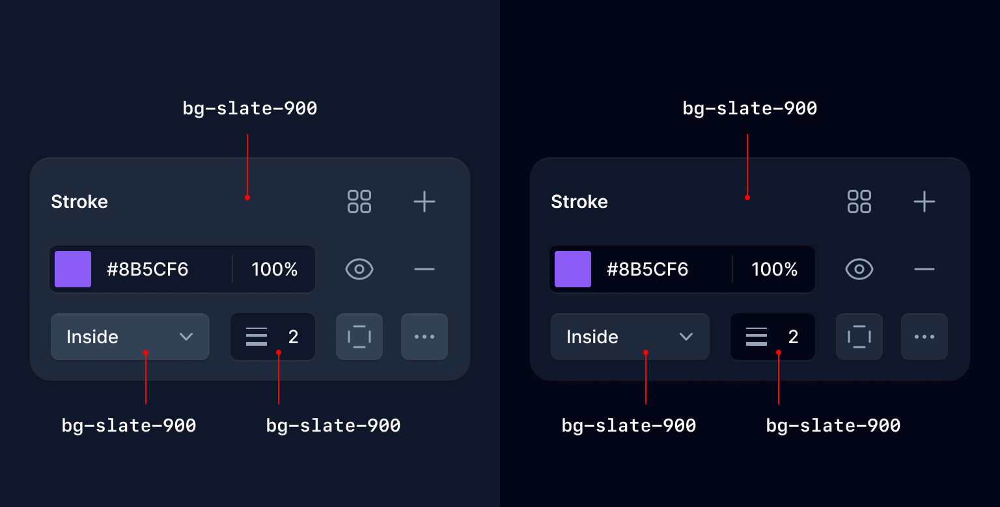
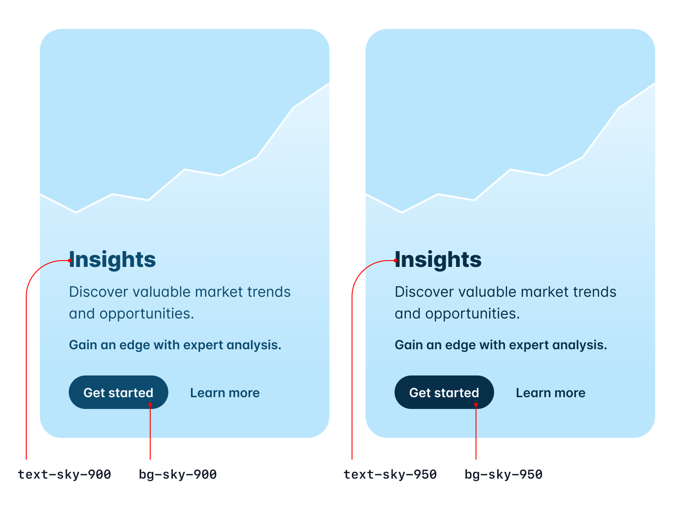
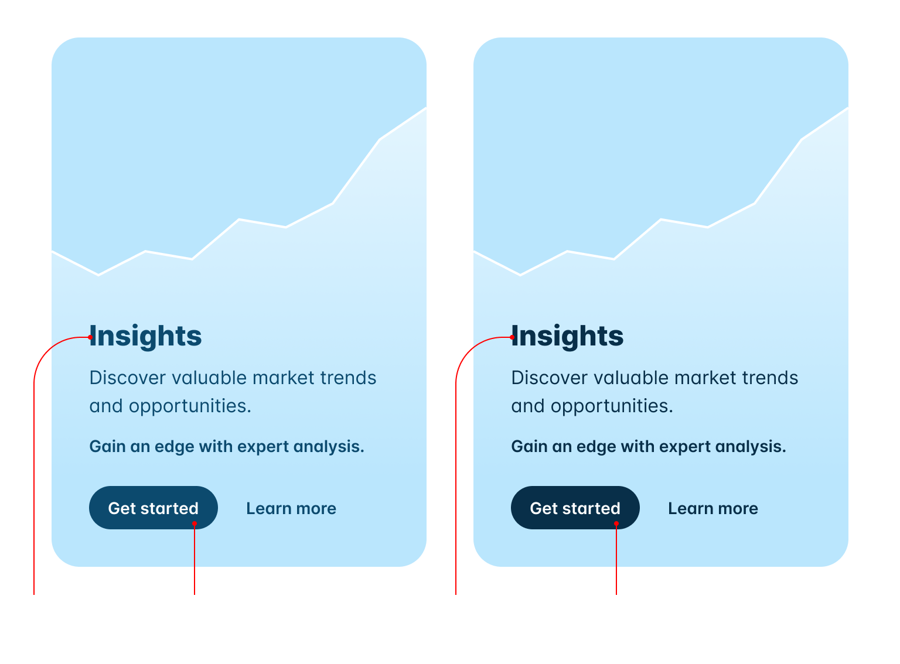

import { adamwathan } from '@/authors'
import card from './card.jpg'
import { SnippetGroup } from '@/components/SnippetGroup'

export const meta = {
  title: 'Tailwind CSS v3.3: Extended color palette, ESM/TS support, logical properties, and more',
  description: `Tailwind CSS v3.3 is here — bringing a bunch of new features people have been asking for forever, and a bunch of new stuff you didn't even know you wanted.`,
  date: '2023-03-28T14:30:00.000Z',
  authors: [adamwathan],
  image: card,
}

{/*excerpt*/}

Tailwind CSS v3.3 is here — bringing a bunch of new features people have been asking for forever, and a bunch of new stuff you didn't even know you wanted.

{/*/excerpt*/}


Tailwind CSS v3.3 is here — bringing a bunch of new features people have been asking for forever, and a bunch of new stuff you didn't even know you wanted.

- [Extended color palette for darker darks:](#extended-color-palette-for-darker-darks) New darker 950 shades for every color.
- [ESM and TypeScript support:](#esm-and-type-script-support) Write your config file using ESM or TypeScript.
- [Simplified RTL support with logical properties:](#simplified-rtl-support-with-logical-properties) Build layouts that adapt to different directions.
- [Fine-tune gradient color stop positions:](#fine-tune-gradient-color-stop-positions) Specify exactly where you want each color stop to go.
- [Line-clamp out of the box:](#line-clamp-out-of-the-box) Truncate multi-line text without a plugin.
- [New line-height modifier:](#new-line-height-shorthand-for-font-size-utilities) Set your font-size and line-height with one class.
- [CSS variables without the var()](#css-variables-without-the-var): New shorthand syntax for arbitrary values.
- [Configurable `font-variation-settings`:](#configure-font-variation-settings-for-custom-font-families) Baked directly into your `font-*` utilities.
- [New `list-style-image` utilities:](#new-list-style-image-utilities) So you can use horrible clip art for bullet points.
- [New `hyphens` utilities:](#new-hyphens-utilities) For fine-tuning hyphenation behavior.
- [New `caption-side` utilities:](#new-caption-side-utilities) Title your tables with style.

That covers the most exciting stuff, but check out the [release notes](https://github.com/tailwindlabs/tailwindcss/releases/tag/v3.3.0) for an exhaustive list of every single little improvement we've made since the last release.

Upgrading your projects is as easy as installing the latest version of `tailwindcss` from npm:

```sh
npm install -D tailwindcss@latest
```

You can also try out all of the new features on [Tailwind Play](https://play.tailwindcss.com), right in your browser.

---

## Extended color palette for darker darks

One of the most common feature requests we've had over the years is to add darker shades for every color — usually because someone is building a dark UI and just wants more options down in that dark end of the spectrum.

Well wish granted — in Tailwind CSS v3.3 we've added a new `950` shade for every single color.

In the grays they act as basically a tinted black, which is great for ultra dark UIs:



And in the rest of the color spectrum we optimized `950` for high contrast text and tinted control backgrounds:

<div className="contents dark:hidden">

</div>

<div className="hidden dark:contents">

</div>

Believe it or not the hardest part about this project was convincing ourselves to be okay with having 11 shades per color. Trying to make that look good in the [color palette documentation](/docs/customizing-colors) was a nightmare.

Also pour one out for the 50 shades of gray jokes we used to be able to make.

---

## ESM and TypeScript support

Now you can configure Tailwind CSS in ESM, or even in TypeScript:

<SnippetGroup style="framed">

```js {{ filename: 'ES Module' }}
/** @type {import('tailwindcss').Config} */
export default {
  content: [],
  theme: {
    extend: {},
  },
  plugins: [],
}

```

```js {{ filename: 'TypeScript' }}
import type { Config } from 'tailwindcss'

export default {
  content: [],
  theme: {
    extend: {},
  },
  plugins: [],
} satisfies Config
```

</SnippetGroup>

When you run `npx tailwindcss init`, we'll detect if your project is an ES Module and automatically generate your config file with the right syntax.

You can also generate an ESM config file explicitly by using the `--esm` flag:

```sh
npx tailwindcss init --esm
```

To generate a TypeScript config file, use the `--ts` flag:

```sh
npx tailwindcss init --ts
```

A lot of people assume this is easy because they're writing their own code in ESM already (even if it's being transpiled by their build tool) but it's actually pretty tricky — we literally have to transpile the config file for you on the fly.

It's a bit easier to understand why this has to happen when you think of the TypeScript case, because of course Tailwind is distributed as JavaScript, and it can't magically import an uncompiled TypeScript file.

We're handling this with the wonderful [jiti](https://github.com/unjs/jiti) library under the hood, and using [Sucrase](https://github.com/alangpierce/sucrase) to transpile the code with the best possible performance while keeping the installation footprint small.

---

## Simplified RTL support with logical properties

We've made it possible to style multi-directional websites using our [LTR and RTL variants](/docs/hover-focus-and-other-states#rtl-support) for a while, but now you can use [logical properties](https://developer.mozilla.org/en-US/docs/Web/CSS/CSS_Logical_Properties/Basic_concepts) to do most of this styling more easily and automatically.

Using new utilities like `ms-3` and `me-3`, you can style the _start_ and _end_ of an element so that your styles automatically adapt in RTL, instead of writing code like `ltr:ml-3 rtl:mr-3`:

```html {{ example: true }}
<div class="grid grid-cols-1 sm:grid-cols-2 gap-x-6 gap-y-10 max-w-lg mx-auto">
  <div dir="ltr">
    <p class="mb-4 text-sm font-medium">Left-to-right</p>
    <div class="group flex items-center">
      
      <div class="ms-3">
        <p class="text-sm font-medium text-slate-700 group-hover:text-slate-900 dark:text-slate-300 dark:group-hover:text-white">Tom Cook</p>
        <p class="text-sm font-medium text-slate-500 group-hover:text-slate-700 dark:group-hover:text-slate-300">Director of Operations</p>
      </div>
    </div>
  </div>
  <div dir="rtl">
    <p class="mb-4 text-sm font-medium">Right-to-left</p>
    <div class="group flex items-center">
      
      <div class="ms-3">
        <p class="text-sm font-medium text-slate-700 group-hover:text-slate-900 dark:text-slate-300 dark:group-hover:text-white">تامر كرم</p>
        <p class="text-sm font-medium text-slate-500 group-hover:text-slate-700 dark:group-hover:text-slate-300">الرئيس التنفيذي</p>
      </div>
    </div>
  </div>
</div>
```

```diff-html
  <div class="group flex items-center">
    
-   <div class="ltr:ml-3 rtl:mr-3">
+   <div class="ms-3">
      <p class="text-sm font-medium text-slate-700 group-hover:text-slate-900" dark-class="text-sm font-medium text-slate-300 group-hover:text-white">...</p>
      <p class="text-sm font-medium text-slate-500 group-hover:text-slate-700" dark-class="text-sm font-medium text-slate-500 group-hover:text-slate-300">...</p>
    </div>
  </div>
```

We've added new logical property utilities for [inset](/docs/top-right-bottom-left), [margin](/docs/margin), [padding](/docs/padding), [border-radius](/docs/border-radius), [scroll-margin](/docs/scroll-margin), and [scroll-padding](/docs/scroll-padding).

Here's a full list of all of the new utilities we've added and what they map to:

<div className="-mx-4 overflow-x-auto sm:mx-0">
  <div className="inline-block min-w-full align-middle whitespace-nowrap">
    <table>
      <thead>
        <tr>
          <th className="pl-4 sm:pl-0">New class</th>
          <th>Properties</th>
          <th className="pr-4 sm:pr-0">Physical counterpart (LTR)</th>
        </tr>
      </thead>
      <tbody>
        <tr>
          <td className="pl-4 sm:pl-0"><code>{'start-*'}</code></td>
          <td><code>inset-inline-start</code></td>
          <td className="pr-4 sm:pr-0"><code>{'left-*'}</code></td>
        </tr>
        <tr>
          <td className="pl-4 sm:pl-0"><code>end-*</code></td>
          <td><code>inset-inline-end</code></td>
          <td className="pr-4 sm:pr-0"><code>{'right-*'}</code></td>
        </tr>
        <tr>
          <td className="pl-4 sm:pl-0"><code>{'ms-*'}</code></td>
          <td><code>margin-inline-start</code></td>
          <td className="pr-4 sm:pr-0"><code>{'ml-*'}</code></td>
        </tr>
        <tr>
          <td className="pl-4 sm:pl-0"><code>{'me-*'}</code></td>
          <td><code>margin-inline-end</code></td>
          <td className="pr-4 sm:pr-0"><code>{'mr-*'}</code></td>
        </tr>
        <tr>
          <td className="pl-4 sm:pl-0"><code>{'ps-*'}</code></td>
          <td><code>padding-inline-start</code></td>
          <td className="pr-4 sm:pr-0"><code>{'pl-*'}</code></td>
        </tr>
        <tr>
          <td className="pl-4 sm:pl-0"><code>{'pe-*'}</code></td>
          <td><code>padding-inline-end</code></td>
          <td className="pr-4 sm:pr-0"><code>{'pr-*'}</code></td>
        </tr>
        <tr>
          <td className="pl-4 sm:pl-0"><code>{'rounded-s-*'}</code></td>
          <td><code>border-start-start-radius</code><br /><code>border-end-start-radius</code></td>
          <td className="pr-4 sm:pr-0"><code>{'rounded-l-*'}</code></td>
        </tr>
        <tr>
          <td className="pl-4 sm:pl-0"><code>{'rounded-e-*'}</code></td>
          <td><code>border-start-end-radius</code><br /><code>border-end-end-radius</code></td>
          <td className="pr-4 sm:pr-0"><code>{'rounded-r-*'}</code></td>
        </tr>
        <tr>
          <td className="pl-4 sm:pl-0"><code>{'rounded-ss-*'}</code></td>
          <td><code>border-start-start-radius</code></td>
          <td className="pr-4 sm:pr-0"><code>{'rounded-tl-*'}</code></td>
        </tr>
        <tr>
          <td className="pl-4 sm:pl-0"><code>{'rounded-se-*'}</code></td>
          <td><code>border-start-end-radius</code></td>
          <td className="pr-4 sm:pr-0"><code>{'rounded-tr-*'}</code></td>
        </tr>
        <tr>
          <td className="pl-4 sm:pl-0"><code>{'rounded-ee-*'}</code></td>
          <td><code>border-end-end-radius</code></td>
          <td className="pr-4 sm:pr-0"><code>{'rounded-br-*'}</code></td>
        </tr>
        <tr>
          <td className="pl-4 sm:pl-0"><code>{'rounded-es-*'}</code></td>
          <td><code>border-end-start-radius</code></td>
          <td className="pr-4 sm:pr-0"><code>{'rounded-bl-*'}</code></td>
        </tr>
        <tr>
          <td className="pl-4 sm:pl-0"><code>{'border-s-*'}</code></td>
          <td><code>border-inline-start-width</code></td>
          <td className="pr-4 sm:pr-0"><code>{'border-l-*'}</code></td>
        </tr>
        <tr>
          <td className="pl-4 sm:pl-0"><code>{'border-e-*'}</code></td>
          <td><code>border-inline-end-width</code></td>
          <td className="pr-4 sm:pr-0"><code>{'border-r-*'}</code></td>
        </tr>
        <tr>
          <td className="pl-4 sm:pl-0"><code>{'border-s-*'}</code></td>
          <td><code>border-inline-start-color</code></td>
          <td className="pr-4 sm:pr-0"><code>{'border-l-*'}</code></td>
        </tr>
        <tr>
          <td className="pl-4 sm:pl-0"><code>{'border-e-*'}</code></td>
          <td><code>border-inline-end-color</code></td>
          <td className="pr-4 sm:pr-0"><code>{'border-r-*'}</code></td>
        </tr>
        <tr>
          <td className="pl-4 sm:pl-0"><code>{'scroll-ms-*'}</code></td>
          <td><code>scroll-margin-inline-start</code></td>
          <td className="pr-4 sm:pr-0"><code>{'scroll-ml-*'}</code></td>
        </tr>
        <tr>
          <td className="pl-4 sm:pl-0"><code>{'scroll-me-*'}</code></td>
          <td><code>scroll-margin-inline-end</code></td>
          <td className="pr-4 sm:pr-0"><code>{'scroll-mr-*'}</code></td>
        </tr>
        <tr>
          <td className="pl-4 sm:pl-0"><code>{'scroll-ps-*'}</code></td>
          <td><code>scroll-padding-inline-start</code></td>
          <td className="pr-4 sm:pr-0"><code>{'scroll-pl-*'}</code></td>
        </tr>
        <tr>
          <td className="pl-4 sm:pl-0"><code>{'scroll-pe-*'}</code></td>
          <td><code>scroll-padding-inline-end</code></td>
          <td className="pr-4 sm:pr-0"><code>{'scroll-pr-*'}</code></td>
        </tr>
      </tbody>
    </table>
  </div>
</div>

These should save you a ton of code if you regularly build sites that need to support both LTR and RTL languages, and you can always combine these with the `ltr` and `rtl` variants when you need more control.

---

## Fine-tune gradient color stop positions

We've added new utilities like `from-5%`, `via-35%`, and `to-85%` that let you adjust the actual position of each color stop in your gradients:

<svg className="hidden" hidden>
  <symbol id="gradient-color-stop" viewBox="0 0 32 34">
    <path d="M1 4a4 4 0 0 1 4-4h22a4 4 0 0 1 4 4v19.6a4 4 0 0 1-2.118 3.53L16 34 3.118 27.13A4 4 0 0 1 1 23.6V4Z"/>
    <path fill="none" stroke="#000" strokeOpacity=".05" d="M5 .5h22A3.5 3.5 0 0 1 30.5 4v19.6a3.5 3.5 0 0 1-1.853 3.088L16 33.433 3.353 26.688A3.5 3.5 0 0 1 1.5 23.6V4A3.5 3.5 0 0 1 5 .5Z"/>
  </symbol>
</svg>

```html {{ example: true }}
<div class="mx-5">
  <div class="relative h-[3.625rem]">
    <div class="h-12 flex flex-col items-center absolute top-0 left-[10%] -ml-4">
      <svg viewBox="0 0 32 34" class="flex-none fill-indigo-500 w-8 drop-shadow">
        <use href="#gradient-color-stop" />
      </svg>
      <div class="mt-2 w-0.5 h-2 bg-gray-900/30 dark:bg-white/30"></div>
      <div class="absolute top-0 left-0 w-full h-8 flex items-center justify-center text-[0.6875rem] font-semibold text-white font-mono">10%</div>
    </div>
    <div class="h-12 flex flex-col items-center absolute top-0 left-[30%] -ml-4">
      <svg viewBox="0 0 32 34" class="flex-none fill-sky-500 w-8 drop-shadow">
        <use href="#gradient-color-stop" />
      </svg>
      <div class="mt-2 w-0.5 h-2 bg-gray-900/30 dark:bg-white/30"></div>
      <div class="absolute top-0 left-0 w-full h-8 flex items-center justify-center text-[0.6875rem] font-semibold text-white font-mono">30%</div>
    </div>
    <div class="h-12 flex flex-col items-center absolute top-0 right-[10%] -mr-4">
      <svg viewBox="0 0 32 34" class="flex-none fill-emerald-500 w-8 drop-shadow">
        <use href="#gradient-color-stop" />
      </svg>
      <div class="mt-2 w-0.5 h-2 bg-gray-900/30 dark:bg-white/30"></div>
      <div class="absolute top-0 left-0 w-full h-8 flex items-center justify-center text-[0.6875rem] font-semibold text-white font-mono">90%</div>
    </div>
  </div>
  <div class="h-10 rounded-lg bg-gradient-to-r from-indigo-500 from-10% via-sky-500 via-30% to-emerald-500 to-90%"></div>
</div>
```

```html
<div class="bg-gradient-to-r from-indigo-500 **from-10%** via-purple-500 **via-30%** to-pink-500 **to-90%** ...">
  <!-- ... -->
</div>
```

We've included every value from 0% to 100% in steps of 5 out of the box, but you can of course use arbitrary values to get exactly the effect you want:

```html
<div class="bg-gradient-to-r from-cyan-400 **from-[21.56%]** ...">
  <!-- ... -->
</div>
```

For more details, check out the [gradient color stops documentation](/docs/gradient-color-stops#specifying-stop-positions).

---

## Line-clamp out of the box

We released our [official line-clamp plugin](/blog/multi-line-truncation-with-tailwindcss-line-clamp) just over two years ago and even though it uses a bunch of weird deprecated `-webkit-*` stuff, it works in every browser and it's going to work forever, so we decided to just bake it into the framework itself.

```html {{ example: { p: 'none' } }}
<div class="px-4 sm:px-0">
  <article class="mx-auto max-w-sm bg-white p-8 text-sm leading-6 text-slate-700 shadow-xl dark:bg-slate-800 dark:text-slate-400 sm:text-base sm:leading-7">
    <time datetime="2020-03-16" class="block text-sm leading-6 text-slate-500 dark:text-slate-400">Mar 10, 2020</time>
    <h2 class="mt-2 text-lg font-semibold text-slate-900 dark:text-slate-200">Boost your conversion rate</h2>
    <p class="line-clamp-3 mt-4 text-sm leading-6 text-slate-500 dark:text-slate-400">Nulla dolor velit adipisicing duis excepteur esse in duis nostrud occaecat mollit incididunt deserunt sunt. Ut ut sunt laborum ex occaecat eu tempor labore enim adipisicing minim ad. Est in quis eu dolore occaecat excepteur fugiat dolore nisi aliqua fugiat enim ut cillum. Labore enim duis nostrud eu. Est ut eiusmod consequat irure quis deserunt ex. Enim laboris dolor magna pariatur. Dolor et ad sint voluptate sunt elit mollit officia ad enim sit consectetur enim.</p>
    <div class="mt-4 flex gap-x-2.5 text-sm font-semibold leading-6 text-slate-900 dark:text-slate-200">
      
      Lindsay Walton
    </div>
  </article>
</div>
```

```html
  <article>
    <div>
      <time datetime="2020-03-16" class="block text-sm/6 text-gray-600">Mar 10, 2020</time>
      <h2 class="mt-2 text-lg font-semibold text-gray-900">Boost your conversion rate</h2>
>     <p class="**line-clamp-3** mt-4 text-sm/6 text-gray-600">
        Nulla dolor velit adipisicing duis excepteur esse in duis nostrud occaecat mollit incididunt deserunt sunt. Ut ut sunt laborum ex occaecat eu tempor labore enim adipisicing minim ad. Est in quis eu dolore occaecat excepteur fugiat dolore nisi aliqua fugiat enim ut cillum. Labore enim duis nostrud eu. Est ut eiusmod consequat irure quis deserunt ex. Enim laboris dolor magna pariatur. Dolor et ad sint voluptate sunt elit mollit officia ad enim sit consectetur enim.
      </p>
    </div>
    <div class="mt-4 flex gap-x-2.5 text-sm font-semibold leading-6 text-gray-900">
      
      Lindsay Walton
    </div>
  </article>
```

So when you upgrade to v3.3, you can safely remove the line-clamp plugin if you were using it:

```diff-js {{ filename: 'tailwind.config.js' }}
  module.exports = {
    // ...
    plugins: [
-     require('@tailwindcss/line-clamp')
    ]
  }
```

Don't let the door hit you in the ass on the way out, plugin.

Check out the new [line-clamp documentation](/docs/line-clamp) to learn more about how it all works if you haven't played with it before.

---

## New line-height shorthand for font-size utilities

One thing we've found over years and years of designing beautiful stuff with Tailwind is that we literally _never_ set a line-height without also setting the font-size at the same time.

So inspired by our color opacity modifier syntax, we decided to make it possible to save a few characters by setting them together with a single utility:

```diff-html {{ filename: 'index.html', style: 'framed', color: 'indigo' }}
-   <p class="**text-lg leading-7** ...">
+   <p class="**text-lg/7** ...">
      So I started to walk into the water. I won't lie to you boys, I was terrified. But
      I pressed on, and as I made my way past the breakers a strange calm came over me.
      I don't know if it was divine intervention or the kinship of all living things but
      I tell you Jerry at that moment, I <em>was</em> a marine biologist.
    </p>
```

You can use any value defined in your [line-height scale](/docs/line-height), or use arbitrary values if you need to deviate from your design tokens:

```html
<p class="text-sm**/[17px]** ..."></p>
```

Check out the [font size documentation](/docs/font-size#setting-the-line-height) for a few more examples.

---

## CSS variables without the `var()`

In the spirit of typing less, we've also made it possible to omit the `var()` when using a CSS variable as an arbitrary value:

```diff-jsx {{ style: 'framed', filename: 'my-component.jsx', color: 'sky' }}
  export function MyComponent({ company }) {
    return (
      <div
        style={{
          '--brand-color': company.brandColor,
          '--brand-hover-color': company.brandHoverColor,
        }}
-       className="bg-[var(--brand-color)] hover:bg-[var(--brand-hover-color)]"
+       className="bg-[--brand-color] hover:bg-[--brand-hover-color]"
      />
    )
  }
```

That's a pretty cool trick right there for using things like `hover:` with styles that come from the database or something by the way.

---

## Configure `font-variation-settings` for custom font families

When using custom fonts, you'll often want to configure things like `font-feature-settings` or `font-variation-settings` to opt-in to specific tweaks the font offers.

We've made it easy to do this for `font-feature-settings` for a while, but now you can do the same thing with `font-variation-settings` by providing a value for it in the sort-of options object you can plop after the font list in your config file:

```js {{ filename: 'tailwind.config.js', style: 'framed', color: 'indigo' }}
  module.exports = {
    theme: {
      fontFamily: {
        sans: [
          'Inter var, sans-serif',
>         {
>           fontFeatureSettings: '"cv11", "ss01"',
>           fontVariationSettings: '"opsz" 32',
>         },
        ],
      },
    },
  }
```

In the example above we're using a recent release of [Inter](https://github.com/rsms/inter/releases/tag/v4.0-beta7) that supports using the optical size axis to trigger the "Display" variation of the font, optimized for larger sizes like headlines.

---

## New `list-style-image` utilities

Ever wanted to use a picture of a carrot as your list item marker? Well now you can, with the new `list-image-*` utilities.

```html {{ example: { p: 'none' } }}
<div class="px-4 sm:px-0">
  <div class="mx-auto max-w-sm bg-white p-8 text-sm leading-6 text-slate-700 shadow-xl dark:bg-slate-800 dark:text-slate-400 sm:text-base sm:leading-7">
    <ul class="pl-4 text-slate-900 dark:text-slate-200 marker:text-2xl list-image-[url('data:image/svg+xml;base64,PHN2ZyB4bWxucz0iaHR0cDovL3d3dy53My5vcmcvMjAwMC9zdmciIHZpZXdCb3g9IjAgMCA1MTIgNTEyIiBmaWxsPSIjZjk3MzE2Ij48cGF0aCBkPSJNMzQ2LjcgNkMzMzcuNiAxNyAzMjAgNDIuMyAzMjAgNzJjMCA0MCAxNS4zIDU1LjMgNDAgODBzNDAgNDAgODAgNDBjMjkuNyAwIDU1LTE3LjYgNjYtMjYuN2M0LTMuMyA2LTguMiA2LTEzLjNzLTItMTAtNi0xMy4yYy0xMS40LTkuMS0zOC4zLTI2LjgtNzQtMjYuOGMtMzIgMC00MCA4LTQwIDhzOC04IDgtNDBjMC0zNS43LTE3LjctNjIuNi0yNi44LTc0QzM3MCAyIDM2NS4xIDAgMzYwIDBzLTEwIDItMTMuMyA2ek0yNDQuNiAxMzZjLTQwIDAtNzcuMSAxOC4xLTEwMS43IDQ4LjJsNjAuNSA2MC41YzYuMiA2LjIgNi4yIDE2LjQgMCAyMi42cy0xNi40IDYuMi0yMi42IDBsLTU1LjMtNTUuMyAwIC4xTDIuMiA0NzcuOUMtMiA0ODctLjEgNDk3LjggNyA1MDVzMTcuOSA5IDI3LjEgNC44bDEzNC43LTYyLjQtNTIuMS01Mi4xYy02LjItNi4yLTYuMi0xNi40IDAtMjIuNnMxNi40LTYuMiAyMi42IDBMMTk5LjcgNDMzbDEwMC4yLTQ2LjRjNDYuNC0yMS41IDc2LjItNjggNzYuMi0xMTkuMkMzNzYgMTk0LjggMzE3LjIgMTM2IDI0NC42IDEzNnoiLz48L3N2Zz4=')]">
      <li class="pl-2">5 cups chopped Porcini mushrooms</li>
      <li class="pl-2">1/2 cup of olive oil</li>
      <li class="pl-2">3lb of celery</li>
    </ul>
  </div>
</div>
```

```html
<ul class="**list-image-[url(carrot.png)]** ...">
  <li>5 cups chopped Porcini mushrooms</li>
  <!-- ... -->
</ul>
```

We're not going to start shipping vegetable clip art with the framework, but you can use any image you want either as an arbitrary value or configuring it in the `listStyleImage` section of your theme.

Check out the [list style image documentation](/docs/list-style-image) to learn more.

---

## New `hyphens` utilities

Ever heard of the `&shy;` HTML entity? Me neither until we added support for these `hyphens-*` utilities.

Using `hyphens-manual` and a carefully placed `&shy;`, you can tell the browser where to insert a hyphen when it needs to break a word across multiple lines:

```html {{ example: { p: 'none' } }}
<div class="overflow-x-scroll sm:overflow-x-visible px-4">
  <div class="mx-auto max-w-xs bg-white shadow-xl p-12 text-slate-500 dark:bg-slate-800 dark:text-slate-400">
     <p class="hyphens-manual">Officially recognized by the Duden dictionary as the longest word in German, <span class="text-slate-900 font-medium dark:text-slate-200" lang="de"> Kraftfahrzeug&shy;haftpflichtversicherung</span> is a 36 letter word for motor vehicle liability insurance.</p>
  </div>
</div>
```

```html
<p class="**hyphens-manual** ...">
    ... Kraftfahrzeug**&shy;**haftpflichtversicherung is a ...
</p>
```

Maybe a code snippet like this would be useful to include as part of your unpronounceable death metal band's press kit so the journalists don't screw up the hyphenation in the article that finally breaks you on to the scene.

Check out the [hyphens documentation](/docs/hyphens) to learn more.

---

## New `caption-side` utilities

Another new one for me — the `<caption>` element! We've got new `caption-*` utilities you can use on table captions to control whether they appear at the top or bottom of the table they're attached to.

```html {{ example: { p: 'none' } }}
<div class="shadow-sm overflow-hidden px-4 py-8 sm:px-8">
  <table class="border-collapse table-auto w-full text-sm">
    <caption class="text-slate-500 dark:text-slate-400 pt-4 text-xs caption-bottom">
        Table 3.1: Professional wrestlers and their signature moves.
    </caption>
    <thead>
      <tr>
        <th class="border dark:border-slate-600 font-medium p-4 pl-8 pt-3 pb-3 text-slate-400 dark:text-slate-200 text-left">Wrestler</th>
        <th class="border dark:border-slate-600 font-medium p-4 pr-8 pt-3 pb-3 text-slate-400 dark:text-slate-200 text-left">Signature Move(s)</th>
      </tr>
    </thead>
    <tbody class="bg-white dark:bg-slate-800">
      <tr>
        <td class="border border-slate-200 dark:border-slate-600 p-4 pl-8 text-slate-500 dark:text-slate-400">"Stone Cold" Steve Austin</td>
        <td class="border border-slate-200 dark:border-slate-600 p-4 pr-8 text-slate-500 dark:text-slate-400">Stone Cold Stunner, Lou Thesz Press</td>
      </tr>
      <tr>
        <td class="border border-slate-200 dark:border-slate-600 p-4 pl-8 text-slate-500 dark:text-slate-400">Bret "The Hitman" Hart</td>
        <td class="border border-slate-200 dark:border-slate-600 p-4 pr-8 text-slate-500 dark:text-slate-400">The Sharpshooter</td>
      </tr>
      <tr>
        <td class="border border-slate-200 dark:border-slate-600 p-4 pl-8 text-slate-500 dark:text-slate-400">Razor Ramon</td>
        <td class="border border-slate-200 dark:border-slate-600 p-4 pr-8 text-slate-500 dark:text-slate-400">Razor's Edge, Fallaway Slam</td>
      </tr>
    </tbody>
  </table>
</div>
```

```html
<table>
  <caption class="**caption-bottom**">
    Table 3.1: Professional wrestlers and their signature moves.
  </caption>
  <thead>
    <tr>
      <th>Wrestler</th>
      <th>Signature Move(s)</th>
    </tr>
  </thead>
  <tbody>
    <tr>
      <td>"Stone Cold" Steve Austin</td>
      <td>Stone Cold Stunner, Lou Thesz Press</td>
    </tr>
    <tr>
      <td>Bret "The Hitman" Hart</td>
      <td >The Sharpshooter</td>
    </tr>
    <tr>
      <td>Razor Ramon</td>
      <td>Razor's Edge, Fallaway Slam</td>
    </tr>
  </tbody>
</table>
```

Check out the [caption side documentation](/docs/caption-side) for some more examples.

---

So that's Tailwind CSS v3.3! No breaking changes, just a bunch of fun new stuff. Give it a try in your projects today by updating to the latest version with npm:

```sh
npm install -D tailwindcss@latest
```

Yep, another release without `text-shadow` utilities. Remember that episode of Seinfeld where Kramer tries to see how far he can drive without stopping for gas? That's my favorite episode.
